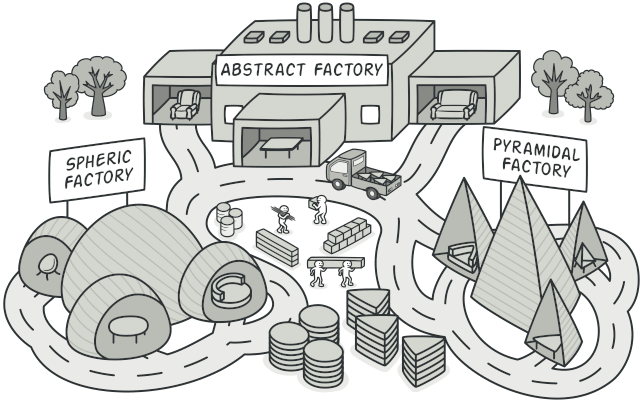
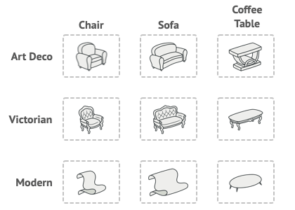
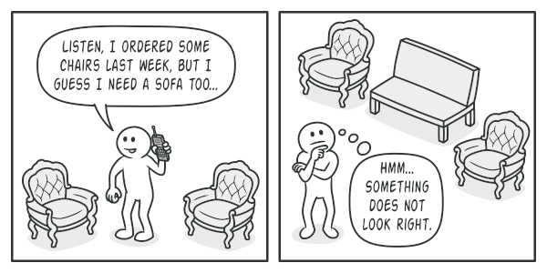
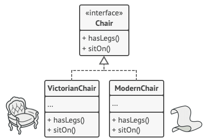
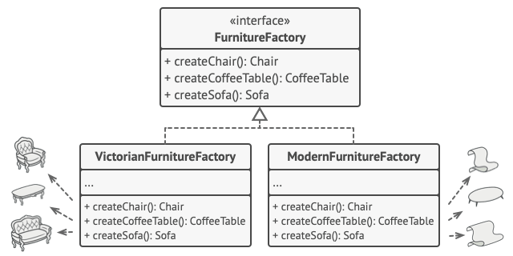
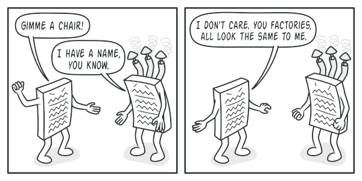
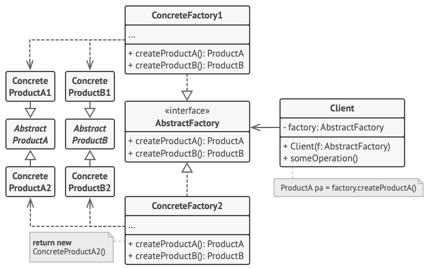
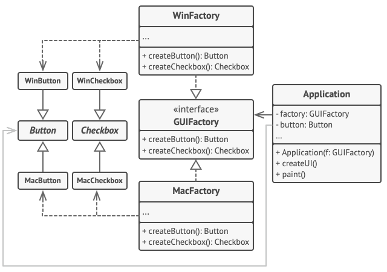

# Abstract Factory 

---

Bu yazı [refactoring.guru](https://refactoring.guru/design-patterns/abstract-factory)'dan çevirilmiş.

---

## Amaç

Soyut Fabrika (`Abstract Factory`), somut sınıflarını belirtmeden ilgili nesnelerin ailelerini oluşturmanıza olanak tanıyan yaratıcı bir tasarım kalıbıdır.



## Problem

Bir mobilya mağazası simülatörü oluşturduğunuzu hayal edin. Kodunuz aşağıdakileri temsil eden sınıflardan oluşur:

1. İlgili ürünlerin ailesi, örneğin: `Chair` + `Sofa` + `CoffeeTable`. (`Sandalye` + `Kanepe` + `KahveMasası`)

2. Bu ailenin birkaç çeşidi. Örneğin, `Chair` + `Sofa` + `CoffeeTable` ürünleri şu varyantlarda mevcuttur: `Modern`, `Victorian`, `ArtDeco`.



*<p align="center">Ürün aileleri ve çeşitleri.</p>*

Aynı aileden, diğer nesnelerle eşleşmeleri için bireysel mobilya nesneleri oluşturmanın bir yoluna ihtiyacınız var. Müşteriler, eşleşmeyen mobilyalar aldıklarında oldukça sinirleniyorlar.



*<p align="center">Modern tarzdaki bir kanepe, Viktorya tarzı sandalyelerle eşleşmez.</p>*

Ayrıca, programa yeni ürünler veya ürün aileleri eklerken mevcut kodu değiştirmek istemezsiniz. Mobilya satıcıları kataloglarını çok sık günceller ve her seferinde temel kodu değiştirmek istemezsiniz.

## Çözüm

Abstract Factory modelinin önerdiği ilk şey, ürün ailesinin her bir farklı ürünü için (örneğin, sandalye, kanepe veya sehpa) arayüzleri açıkça bildirmektir. Ardından tüm ürün çeşitlerinin bu arayüzleri takip etmesini sağlayabilirsiniz. Örneğin, tüm koltuk çeşitleri, `Chair` arayüzünü uygulayabilir; tüm sehpa çeşitleri, `CoffeeTable` arabirimini vb. uygulayabilir.



*<p align="center">Aynı nesnenin tüm varyantları tek bir sınıf hiyerarşisine taşınmalıdır.</p>*

Bir sonraki adım, ürün ailesinin parçası olan tüm ürünler için (örneğin, `createChair`, `createSofa` ve `createCoffeeTable`) oluşturma yöntemlerinin bir listesini içeren bir arabirim olan *Abstract Factory*'i bildirmektir. Bu yöntemler, daha önce çıkardığımız arabirimler tarafından temsil edilen soyut ürün türlerini döndürmelidir: `Chair` + `Sofa` + `CoffeeTable` vb.



*<p align="center">Her somut fabrika, belirli bir ürün çeşidine karşılık gelir.</p>*

Peki ya ürün çeşitleri? Bir ürün ailesinin her bir çeşidi için `AbstractFactory` arayüzüne dayalı ayrı bir fabrika sınıfı oluşturuyoruz. Bir fabrika, belirli bir türden ürünleri döndüren bir sınıftır. Örneğin, `ModernFurnitureFactory` yalnızca `ModernChair`, `ModernSofa` ve `ModernCoffeeTable` nesneleri oluşturabilir.

Client code, ilgili soyut arayüzler aracılığıyla hem fabrikalar hem de ürünlerle çalışmak zorundadır. Bu, client code'a ilettiğiniz bir fabrikanın türünü ve ayrıca client code'un aldığı ürün çeşidini gerçek client code'unu bozmadan değiştirmenize olanak tanır.




*<p align="center">Müşteri, birlikte çalıştığı fabrikanın somut sınıfıyla ilgilenmemelidir.</p>*

Müşterinin sandalye üretmek için bir fabrika istediğini varsayalım. Müşteri, fabrikanın sınıfının farkında olmak zorunda değildir ve ne tür bir sandalye aldığı önemli değildir. İster modern bir model, ister Viktorya tarzı bir sandalye olsun, müşteri abstract `Chair` arayüzünü kullanarak tüm sandalyelere aynı şekilde davranmalıdır. Bu yaklaşımla müşterinin sandalye hakkında bildiği tek şey, `sitOn` yöntemini bir şekilde uyguladığıdır. Ayrıca, sandalyenin hangi çeşidi iade edilirse edilsin, her zaman aynı fabrika nesnesi tarafından üretilen kanepe veya kahve masası tipiyle eşleşecektir.

Açıklığa kavuşturulması gereken bir şey daha var: müşteri yalnızca soyut arayüzlere maruz kalıyorsa, gerçek fabrika nesnelerini ne yaratır? Genellikle uygulama, başlatma aşamasında somut bir fabrika nesnesi oluşturur. Bundan hemen önce uygulama, yapılandırmaya veya ortam ayarlarına bağlı olarak fabrika türünü seçmelidir.

## Yapı (Structure)



1. `Abstract Products`,  bir ürün ailesini oluşturan bir dizi farklı ancak ilgili ürün için arayüzler bildirir.

2. `Concrete Products`, varyantlara göre gruplandırılmış soyut ürünlerin çeşitli uygulamalarıdır. Her soyut (abstract) ürün (chair/sofa), verilen tüm varyantlarda (Victorian/Modern) uygulanmalıdır.

3. `Abstract Factory` arabirimi, soyut ürünlerin her birini oluşturmak için bir dizi yöntem bildirir.

4. `Concrete Factories`, soyut fabrikanın oluşturma (creation) yöntemlerini uygular. Her somut fabrika, belirli bir ürün çeşidine karşılık gelir ve sadece bu ürün çeşitlerini yaratır.

5. Somut fabrikalar somut ürünleri somutlaştırsalar da, yaratma yöntemlerinin imzaları karşılık gelen soyut ürünleri döndürmelidir. Bu şekilde, bir fabrikayı kullanan client code, bir fabrikadan aldığı ürünün belirli bir çeşidiyle eşleşmez. `Client`, nesneleri ile soyut arayüzler aracılığıyla iletişim kurduğu sürece, herhangi bir somut factory/product çeşidiyle çalışabilir.

## Sözde Kod (Pseudocode)

Bu örnek, oluşturulan tüm öğeleri seçili bir işletim sistemiyle tutarlı tutarken, client code somut UI sınıflarıyla birleştirmeden cross-platform UI öğeleri oluşturmak için `Abstract Factory` modelinin nasıl kullanılabileceğini gösterir.



*<p align="center">Cross-platform kullanıcı arayüzü sınıfları örneği.</p>*

Cross-platform uygulamadaki aynı UI öğelerinin benzer şekilde davranması beklenir, ancak farklı işletim sistemlerinde biraz farklı görünebilir. Ayrıca, UI öğelerinin mevcut işletim sisteminin stiliyle eşleştiğinden emin olmak sizin işiniz. Programınızın Windows'ta yürütüldüğünde macOS denetimlerini oluşturmasını istemezsiniz.

Abstract Factory arabirimi, client code farklı türde UI öğeleri üretmek için kullanabileceği bir dizi oluşturma yöntemi bildirir. Concrete factories, belirli işletim sistemlerine karşılık gelir ve söz konusu işletim sistemine uyan UI öğelerini oluşturur.

Şu şekilde çalışır: Bir uygulama başlatıldığında mevcut işletim sisteminin türünü kontrol eder. Uygulama, işletim sistemiyle eşleşen bir sınıftan bir fabrika nesnesi oluşturmak için bu bilgileri kullanır. Kodun geri kalanı, UI öğeleri oluşturmak için bu fabrikayı kullanır. Bu, yanlış öğelerin oluşturulmasını önler.

Bu yaklaşımla, client code, soyut arayüzleri aracılığıyla bu nesnelerle çalıştığı sürece, somut fabrika sınıflarına ve UI öğelerine bağlı değildir. Bu ayrıca, client code gelecekte ekleyebileceğiniz diğer fabrikaları veya UI öğelerini desteklemesine de olanak tanır.

Sonuç olarak, uygulamanıza her yeni UI öğesi varyasyonu eklediğinizde client code değiştirmeniz gerekmez. Bu öğeleri üreten yeni bir fabrika sınıfı oluşturmanız ve uygun olduğunda o sınıfı seçmesi için uygulamanın başlatma kodunu biraz değiştirmeniz yeterlidir.

```csharp
// The abstract factory interface declares a set of methods that
// return different abstract products. These products are called
// a family and are related by a high-level theme or concept.
// Products of one family are usually able to collaborate among
// themselves. A family of products may have several variants,
// but the products of one variant are incompatible with the
// products of another variant.
interface GUIFactory is
    method createButton():Button
    method createCheckbox():Checkbox


// Concrete factories produce a family of products that belong
// to a single variant. The factory guarantees that the
// resulting products are compatible. Signatures of the concrete
// factory's methods return an abstract product, while inside
// the method a concrete product is instantiated.
class WinFactory implements GUIFactory is
    method createButton():Button is
        return new WinButton()
    method createCheckbox():Checkbox is
        return new WinCheckbox()

// Each concrete factory has a corresponding product variant.
class MacFactory implements GUIFactory is
    method createButton():Button is
        return new MacButton()
    method createCheckbox():Checkbox is
        return new MacCheckbox()


// Each distinct product of a product family should have a base
// interface. All variants of the product must implement this
// interface.
interface Button is
    method paint()

// Concrete products are created by corresponding concrete
// factories.
class WinButton implements Button is
    method paint() is
        // Render a button in Windows style.

class MacButton implements Button is
    method paint() is
        // Render a button in macOS style.

// Here's the base interface of another product. All products
// can interact with each other, but proper interaction is
// possible only between products of the same concrete variant.
interface Checkbox is
    method paint()

class WinCheckbox implements Checkbox is
    method paint() is
        // Render a checkbox in Windows style.

class MacCheckbox implements Checkbox is
    method paint() is
        // Render a checkbox in macOS style.


// The client code works with factories and products only
// through abstract types: GUIFactory, Button and Checkbox. This
// lets you pass any factory or product subclass to the client
// code without breaking it.
class Application is
    private field factory: GUIFactory
    private field button: Button
    constructor Application(factory: GUIFactory) is
        this.factory = factory
    method createUI() is
        this.button = factory.createButton()
    method paint() is
        button.paint()


// The application picks the factory type depending on the
// current configuration or environment settings and creates it
// at runtime (usually at the initialization stage).
class ApplicationConfigurator is
    method main() is
        config = readApplicationConfigFile()

        if (config.OS == "Windows") then
            factory = new WinFactory()
        else if (config.OS == "Mac") then
            factory = new MacFactory()
        else
            throw new Exception("Error! Unknown operating system.")

        Application app = new Application(factory)
```

## Uygulanabilirlik (Applicability)

`Kodunuzun çeşitli ilgili ürün aileleriyle çalışması gerektiğinde, ancak bunun bu ürünlerin somut sınıflarına bağlı olmasını istemiyorsanız, bunlar önceden bilinmiyor olabilir veya yalnızca gelecekteki genişletilebilirliğe izin vermek istediğinizde Abstract Factory kullanın.`

Abstract Factory, ürün ailesinin her sınıfından nesneler oluşturmak için size bir arabirim sağlar. Kodunuz bu arayüz aracılığıyla nesneler oluşturduğu sürece, uygulamanız tarafından halihazırda oluşturulmuş ürünlerle eşleşmeyen bir ürünün yanlış varyantını oluşturma konusunda endişelenmenize gerek yoktur.

* Birincil sorumluluğunu bulanıklaştıran bir dizi [Factory Methods](https://refactoring.guru/design-patterns/factory-method) içeren bir sınıfınız olduğunda Abstract Factory uygulamayı düşünün.

* İyi tasarlanmış bir programda *her sınıf sadece bir şeyden sorumludur*. Bir sınıf birden fazla ürün türüyle uğraştığında, factory methods bağımsız bir fabrika sınıfına veya tam gelişmiş bir Abstract Factory uygulamasına çıkarmaya değer olabilir.

## Nasıl Uygulanır?

*1.* Bu ürünlerin çeşitlerine karşı farklı ürün türlerinden oluşan bir matrisin haritasını çıkarın.

*2.* Tüm ürün türleri için soyut ürün arayüzleri bildirin. Ardından, tüm somut ürün sınıflarının bu arabirimleri uygulamasını sağlayın.

*3.* Tüm soyut ürünler için bir dizi oluşturma yöntemiyle soyut fabrika arabirimini bildirin.

*4.* Her ürün çeşidi için bir tane olmak üzere bir dizi somut fabrika sınıfı uygulayın.

*5.* Uygulamada bir yerde fabrika başlatma kodu oluşturun. Uygulama yapılandırmasına veya mevcut ortama bağlı olarak, somut fabrika sınıflarından birini başlatması gerekir. Bu fabrika nesnesini, ürünleri oluşturan tüm sınıflara iletin.

*6.* Kodu tarayın ve ürün kurucularına yapılan tüm doğrudan aramaları bulun. Bunları fabrika nesnesindeki uygun oluşturma yöntemine yapılan çağrılarla değiştirin.

## Artılar ve Eksiler

✓ Bir fabrikadan aldığınız ürünlerin birbiriyle uyumlu olduğundan emin olabilirsiniz.

✓ Somut ürünler ve client code arasındaki sıkı bağlantıdan kaçınırsınız.

✓ Tek Sorumluluk İlkesi (Single Responsibility Principle). Ürün oluşturma kodunu tek bir yere ayırarak kodun desteklenmesini kolaylaştırabilirsiniz.

✓ Açık/Kapalı Prensibi (Open/Closed Principle). Mevcut client code bozmadan yeni ürün çeşitlerini tanıtabilirsiniz.

✗ Modelle birlikte birçok yeni arayüz ve sınıf tanıtıldığından, kod olması gerekenden daha karmaşık hale gelebilir.

## Diğer Paternlerle İlişkiler

- Birçok tasarım, [Factory Method](https://refactoring.guru/design-patterns/factory-method) (daha az karmaşık ve alt sınıflar aracılığıyla daha fazla özelleştirilebilir) kullanılarak başlar ve [Abstract Factory](https://refactoring.guru/design-patterns/abstract-factory), [Prototype](https://refactoring.guru/design-patterns/prototype) veya [Builder](https://refactoring.guru/design-patterns/builder) (daha esnek, ancak daha karmaşık) olarak gelişir.

- [Builder](https://refactoring.guru/design-patterns/builder), adım adım karmaşık nesneler oluşturmaya odaklanır. [Abstract Factory](https://refactoring.guru/design-patterns/abstract-factory), ilgili nesnelerin ailelerini oluşturma konusunda uzmanlaşmıştır. *Abstract Factory* ürünü hemen iade ederken, *Builder* ürünü getirmeden önce bazı ek yapı adımlarını çalıştırmanıza izin verir.

- [Abstract Factory](https://refactoring.guru/design-patterns/abstract-factory) sınıfları genellikle bir dizi [Factory Method](https://refactoring.guru/design-patterns/factory-method)'a dayanır, ancak bu sınıflarda yöntemleri oluşturmak için [Prototype](https://refactoring.guru/design-patterns/prototype)'ı da kullanabilirsiniz.

- [Abstract Factory](https://refactoring.guru/design-patterns/abstract-factory), yalnızca alt sistem nesnelerinin oluşturulma şeklini client code'dan gizlemek istediğinizde [Facade](https://refactoring.guru/design-patterns/facade) bir alternatif olarak hizmet edebilir.

- [Abstract Factory](https://refactoring.guru/design-patterns/abstract-factory)'i [Bridge](https://refactoring.guru/design-patterns/bridge) ile birlikte kullanabilirsiniz. Bu eşleştirme, *Bridge* tarafından tanımlanan bazı soyutlamalar yalnızca belirli uygulamalarla çalışabildiğinde kullanışlıdır. Bu durumda, *Abstract Factory* bu ilişkileri içine alabilir ve karmaşıklığı client code'dan gizleyebilir.

- [Abstract Factories](https://refactoring.guru/design-patterns/abstract-factory), [Builders](https://refactoring.guru/design-patterns/builder) ve [Prototypes](https://refactoring.guru/design-patterns/prototype)'ın tümü [Singletons](https://refactoring.guru/design-patterns/singleton) olarak uygulanabilir.