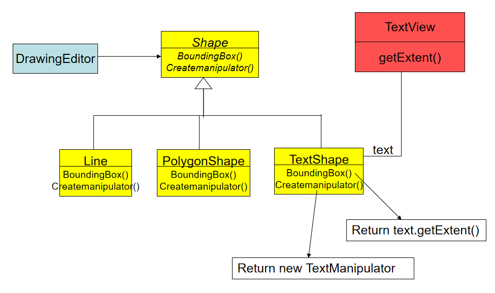
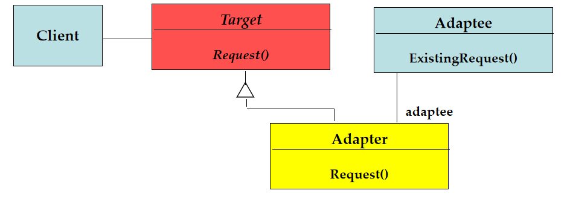
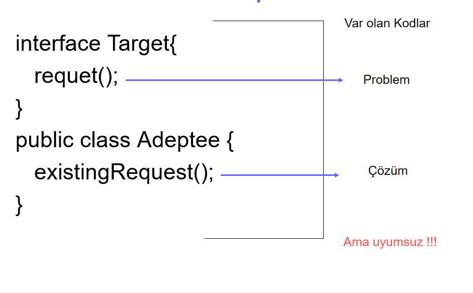
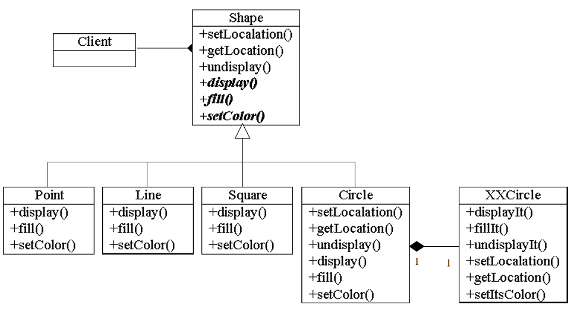

# Adapter Pattern

Bu yazı **Hacettepe BBM** sınıfında 2004-2008 yılları arasında okurken *Tasarım Örüntüleri* dersinde o zamanki hocamız olan *Ebru SEZER*'in yardımcı kaynak olarak verdiği slaytlar üzerinden düzenlenmiştir.

## Adapter Pattern

- Varolan bir sınıf arayüzünü istemcinin beklediği arayüze çevirmek için kullanılır.
- Adaptör ile farklı arayüze sahip olduğu için birlikte çalışamayacak gibi görünen sınıfların birlikte çalışması sağlanırken, sınıfların var olan tanımları üzerinde bir değişiklik gerçekleşmez.



Adaptör yapısı temelde aşağıdaki gibidir.



Bu diyagramdaki sınıfların ilişkisi aşağıdaki gibidir.

- **Adaptör** (Adapter) ve **Adaptee** arasında delegasyon (delegation) vardır.
- **Adapter** sınıfının arayüz belirlemesinde arayüz kalıtımı kullanılır.
- **Target** ve **Adaptee**, Adapter’den önce vardır.
- **Target**, *JAVA*da arayüz (*interface*) olarak kodlanır.

Adaptör sınıfı aşağıdaki gibi tanımlanabilir.

**Adapter** sınıfı (1. Durum):
```java
public class Adapter implements Target{
  private adaptee = new Adaptee();
  public request() {
    adaptee.existingRequest();
  }
}
```



- Adaptör sınıfı, bir interface sınıfını diğerine adapte edebilmek için çoklu katılım kullanır.
- Nesne adaptörü kadar esnek değildir, birden çok *Adaptee* sınıfı ile çalışamaz
- *Adaptee* sınıfının bazı davranışlarını override edebilir. Nesne adaptörü *Adaptee* davranışını override edemez.

O zaman bu şekilde bir yazım ile uyum sorunu giderilebilir.

**Adapter** sınıfı (2. Durum):
```java
public class Adapter implements Target extends Adaptee {
  public request() {
    existingRequest();
  }
}
```

Başka bir örnek verecek olursak;



##### Ne Zaman Uygulanmalı?

- İhtiyaç duyulan işlemleri yerine getiren ama uygunsuz arayüze sahip bir sınıf varsa
- İstemciyi ilgilendirmeyen bir sınıfın istemci farketmeksizin kullanımını sağlamak için yeniden kullanılabilinir bir sınıf tanımlamak 
- (Nesne Adaptörü) Varolan bir çok altsınıf arasında sadece bir tanesi kullanılacak ve arayüzü uyarlanacaksa

#### Sınıf Adaptörü

| Avantajları     | Dezavantajları |
| ----------- | ----------- |
| Sadece yeni bir nesne yaratmak yeterlidir|Kalıtım gerektirir
| Nesne adaptöründen daha az kod gerekir| Bu yüzden esnekliği azdır|
|Adaptee’nin davranışı istenirse değiştirilebilir|

#### Nesne Adaptörü

| Avantajları     | Dezavantajları |
| ----------- | ----------- |
| Daha esnek|Adaptee’nin davranışı değiştirilemez
| Kalıtıma ihtiyacı yok| Daha fazla kod satırına gerek vardır|
|Adapter sınıfı Adaptee’nin bütün altsınıflarına delegasyon yapabilir|