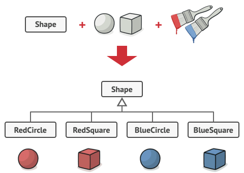
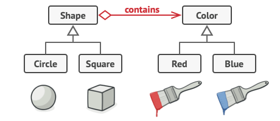
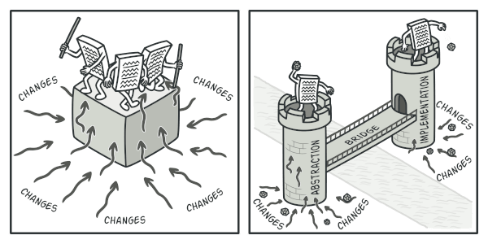
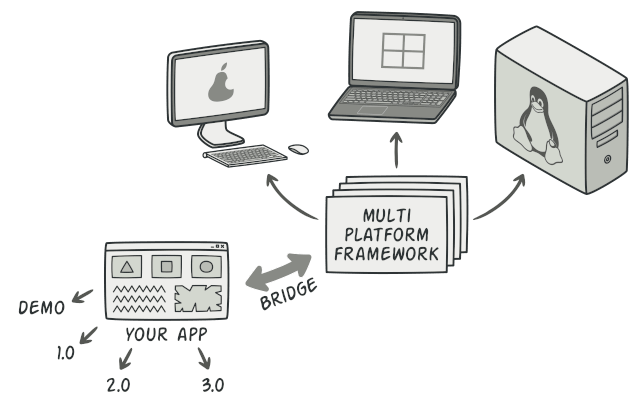
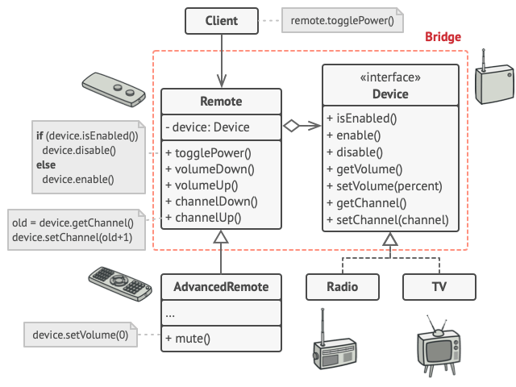

# Bridge Pattern (Köprü Deseni)

---

Bu yazı [refactoring.guru](https://refactoring.guru/design-patterns/bridge)'dan çevirilmiştir.

---

## Amaç

`Bridge`, büyük bir sınıfı veya birbiriyle yakından ilişkili bir dizi sınıfı birbirinden bağımsız olarak geliştirilebilen iki ayrı hiyerarşiye (soyutlama ve uygulama) bölmenizi sağlayan yapısal bir tasarım modelidir.

*<p align="center"></p>*

## Problem

_Soyutlama mı? Uygulama mı? Kulağa korkutucu mu geliyor? Sakin ol ve basit bir örnek düşünelim._

Bir çift alt sınıfa sahip geometrik `Şekil` sınıfınız olduğunu varsayalım: `Daire` ve `Kare`. Bu sınıf hiyerarşisini renkleri içerecek şekilde genişletmek istiyorsunuz, böylece `Kırmızı` ve `Mavi` şekil alt sınıfları oluşturmayı planlıyorsunuz. Ancak, zaten iki alt sınıfınız olduğundan, `MaviDaire` ve `KırmızıKare` gibi dört sınıf birleşimi oluşturmanız gerekir.

*<p align="center"></p>*

*<p align="center">Geometrik ilerlemede sınıf kombinasyonlarının sayısı artar.</p>*

Hiyerarşiye yeni şekil türleri ve renkler eklemek, hiyerarşiyi katlanarak büyütecektir. Örneğin, bir üçgen şekli eklemek için her renk için bir tane olmak üzere iki alt sınıf tanıtmanız gerekir. Bundan sonra, yeni bir renk eklemek, her şekil türü için bir tane olmak üzere üç alt sınıf oluşturmayı gerektirir. Ne kadar ileri gidersek, o kadar kötü olur.

## Çözüm

Bu sorun, şekil sınıflarını iki bağımsız boyutta genişletmeye çalışmamız nedeniyle oluşur: forma ve renge göre. Bu, sınıf mirasıyla ilgili çok yaygın bir sorundur.

Bridge modeli, kalıtımdan nesne kompozisyonuna geçerek bu sorunu çözmeye çalışır. Bunun anlamı, boyutlardan birini ayrı bir sınıf hiyerarşisine çıkarmanızdır, böylece orijinal sınıflar, tüm durum ve davranışları tek bir sınıf içinde bulundurmak yerine yeni hiyerarşinin bir nesnesine başvurur.

*<p align="center"></p>*

*<p align="center">Bir sınıf hiyerarşisinin patlamasını, onu ilgili birkaç hiyerarşiye dönüştürerek önleyebilirsiniz.</p>*

Bu yaklaşımı takiben, renkle ilgili kodu iki alt sınıfla kendi sınıfına çıkarabiliriz: `Kırmızı` ve `Mavi`. `Şekil` sınıfı daha sonra renk nesnelerinden birine işaret eden bir referans alanı alır. Artık şekil, renkle ilgili herhangi bir çalışmayı bağlantılı renk nesnesine devredebilir. Bu referans, `Şekil` ve `Renk` sınıfları arasında bir köprü görevi görecektir. Şu andan itibaren, yeni renkler eklemek, şekil hiyerarşisini değiştirmeyi gerektirmeyecek ve bunun tersi de geçerli.

### Soyutlama ve Uygulama

GoF kitabı, Bridge tanımının bir parçası olarak Soyutlama ve Uygulama terimlerini tanıtır. Benim düşünceme göre, terimler kulağa çok akademik geliyor ve deseni olduğundan daha karmaşık gösteriyor. Şekiller ve renkler ile basit bir örneği okuduktan sonra, GoF kitabının korkutucu sözlerinin arkasındaki anlamı deşifre edelim.

Soyutlama (arayüz olarak da adlandırılır), bazı varlıklar için üst düzey bir kontrol katmanıdır. Bu katmanın kendi başına gerçek bir iş yapması gerekmiyor. İşi uygulama katmanına (platform olarak da adlandırılır) devretmelidir.

Programlama dilinizdeki arayüzlerden veya soyut sınıflardan bahsetmediğimizi unutmayın. Bunlar aynı şeyler değil.

Gerçek uygulamalardan bahsederken, soyutlama bir grafik kullanıcı arabirimi (GUI) ile temsil edilebilir ve uygulama, GUI katmanının kullanıcı etkileşimlerine yanıt olarak çağırdığı temel işletim sistemi kodu (API) olabilir.

Genel olarak konuşursak, böyle bir uygulamayı iki bağımsız yöne genişletebilirsiniz:

* Birkaç farklı GUI'ye sahip olun (örneğin, düzenli müşteriler veya yöneticiler için uyarlanmış).


* Birkaç farklı API'yi destekleyin (örneğin, uygulamayı Windows, Linux ve macOS altında başlatabilmek için).

En kötü senaryoda, bu uygulama yüzlerce koşulun farklı GUI türlerini kodun her yerinde çeşitli API'lerle bağladığı dev bir spagetti kasesi gibi görünebilir.

*<p align="center"></p>*

*<p align="center">Monolitik bir kod tabanında basit bir değişiklik yapmak bile oldukça zordur çünkü her şeyi çok iyi anlamalısınız. Daha küçük, iyi tanımlanmış modüllerde değişiklik yapmak çok daha kolaydır.</p>*

Belirli arayüz-platform kombinasyonları ile ilgili kodu ayrı sınıflara çıkararak bu kaosa düzen getirebilirsiniz. Ancak, yakında bu sınıflardan çok sayıda olduğunu keşfedeceksiniz. Yeni bir GUI eklemek veya farklı bir API'yi desteklemek, daha fazla sınıf oluşturmayı gerektireceğinden, sınıf hiyerarşisi katlanarak büyüyecektir.

Bu sorunu Bridge deseni ile çözmeye çalışalım. Sınıfları iki hiyerarşiye ayırmamızı önerir:

* Soyutlama: uygulamanın GUI katmanı.
* Uygulama: işletim sistemlerinin API'leri.


*<p align="center"></p>*

*<p align="center">Platformlar arası bir uygulamayı yapılandırmanın yollarından biri.</p>*

Soyutlama nesnesi, fiili çalışmayı bağlantılı uygulama nesnesine devrederek uygulamanın görünümünü kontrol eder. Aynı GUI'nin Windows ve Linux altında çalışmasını sağlayan ortak bir arabirimi takip ettikleri sürece farklı uygulamalar birbirinin yerine geçebilir.

Sonuç olarak API ile ilgili sınıflara dokunmadan GUI sınıflarını değiştirebilirsiniz. Ayrıca, başka bir işletim sistemi için destek eklemek, yalnızca uygulama hiyerarşisinde bir alt sınıf oluşturmayı gerektirir.

## Yapı

*<p align="center"></p>*

*1-* Soyutlama, üst düzey kontrol mantığı sağlar. Gerçek düşük seviyeli işi yapmak için uygulama nesnesine dayanır.

*2-* Uygulama, tüm somut uygulamalar için ortak olan arayüzü bildirir. Bir soyutlama, yalnızca burada bildirilen yöntemler aracılığıyla bir uygulama nesnesiyle iletişim kurabilir. <br/> Soyutlama, uygulama ile aynı yöntemleri listeleyebilir, ancak genellikle soyutlama, uygulama tarafından bildirilen çok çeşitli ilkel işlemlere dayanan bazı karmaşık davranışları bildirir.

*3-* Somut Uygulamalar, platforma özel kod içerir.

*4-* Rafine Soyutlamalar, kontrol mantığının çeşitlerini sağlar. Ebeveynleri gibi, genel uygulama arayüzü aracılığıyla farklı uygulamalarla çalışırlar.

*5-* Genellikle, Alıcı(client) yalnızca soyutlama ile çalışmakla ilgilenir. Ancak, soyutlama nesnesini uygulama nesnelerinden biriyle ilişkilendirmek alıcının işidir.

## Sözde Kod (Pseudocode)

Bu örnek, Bridge modelinin, cihazları ve bunların uzaktan kumandalarını yöneten bir uygulamanın monolitik kodunu bölmeye nasıl yardımcı olabileceğini gösterir. `Cihaz` sınıfları uygulama, `Uzaktan Kumanda`'lar ise soyutlama işlevi görür.

*<p align="center"></p>*

*<p align="center">Orijinal sınıf hiyerarşisi iki bölüme ayrılmıştır: cihazlar ve uzaktan kumandalar.</p>*

Temel uzaktan kontrol sınıfı, kendisini bir cihaz nesnesine bağlayan bir referans alanı bildirir. Tüm uzaktan kumandalar, aynı uzaktan kumandanın birden fazla cihaz türünü desteklemesine izin veren genel cihaz arayüzü aracılığıyla cihazlarla çalışır.

Uzaktan kumanda sınıflarını cihaz sınıflarından bağımsız olarak geliştirebilirsiniz. Tüm gereken yeni bir uzak alt sınıf oluşturmaktır. Örneğin, temel bir uzaktan kumandanın yalnızca iki düğmesi olabilir, ancak bunu ekstra pil veya dokunmatik ekran gibi ek özelliklerle genişletebilirsiniz.

İstemci kodu, istenen uzaktan kumanda türünü, uzaktan kumandanın yapıcısı aracılığıyla belirli bir aygıt nesnesine bağlar.

```js
// "Soyutlama", iki sınıf hiyerarşisinin "kontrol" kısmı için arabirimi tanımlar. 
// "Uygulama" hiyerarşisinin bir nesnesine bir referansı korur ve 
// tüm gerçek çalışmayı bu nesneye devreder.
class RemoteControl is
    protected field device: Device
    constructor RemoteControl(device: Device) is
        this.device = device
    method togglePower() is
        if (device.isEnabled()) then
            device.disable()
        else
            device.enable()
    method volumeDown() is
        device.setVolume(device.getVolume() - 10)
    method volumeUp() is
        device.setVolume(device.getVolume() + 10)
    method channelDown() is
        device.setChannel(device.getChannel() - 1)
    method channelUp() is
        device.setChannel(device.getChannel() + 1)


// Soyutlama hiyerarşisinden sınıfları, 
// aygıt sınıflarından bağımsız olarak genişletebilirsiniz.
class AdvancedRemoteControl extends RemoteControl is
    method mute() is
        device.setVolume(0)


// "Uygulama" arabirimi, tüm somut uygulama sınıfları için ortak olan yöntemleri bildirir. 
// Soyutlamanın arayüzüyle eşleşmesi gerekmez. Aslında, iki arayüz tamamen farklı olabilir. 
// Tipik olarak, uygulama arayüzü yalnızca ilkel işlemleri sağlarken, soyutlama, 
// bu ilkellere dayalı daha yüksek seviyeli işlemleri tanımlar.
interface Device is
    method isEnabled()
    method enable()
    method disable()
    method getVolume()
    method setVolume(percent)
    method getChannel()
    method setChannel(channel)


// Tüm cihazlar aynı arayüzü takip eder..
class Tv implements Device is
    // ...

class Radio implements Device is
    // ...


// İstemci kodunda bir yerde.
tv = new Tv()
remote = new RemoteControl(tv)
remote.togglePower()

radio = new Radio()
remote = new AdvancedRemoteControl(radio)
```

## Uygulanabilirlik

**Bazı işlevlerin çeşitli türevlerine sahip monolitik bir sınıfı bölmek ve düzenlemek istediğinizde (örneğin, sınıf çeşitli veritabanı sunucularıyla çalışabiliyorsa) Bridge modelini kullanın.**

Bir sınıf ne kadar büyük olursa, nasıl çalıştığını anlamak o kadar zorlaşır ve bir değişiklik yapmak o kadar uzun sürer. İşlevsellik varyasyonlarından birinde yapılan değişiklikler, tüm sınıf genelinde değişiklikler yapılmasını gerektirebilir, bu da genellikle hata yapılmasına veya bazı kritik yan etkilerin ele alınmamasına neden olur.

Bridge modeli, monolitik sınıfı birkaç sınıf hiyerarşisine bölmenize olanak tanır. Bundan sonra, her bir hiyerarşideki sınıfları, diğerlerindeki sınıflardan bağımsız olarak değiştirebilirsiniz. Bu yaklaşım, kod bakımını basitleştirir ve mevcut kodun kırılma riskini en aza indirir.

**Bir sınıfı birkaç ortogonal (bağımsız) boyutta genişletmeniz gerektiğinde kalıbı kullanın.**

Bridge, boyutların her biri için ayrı bir sınıf hiyerarşisi çıkarmanızı önerir. Orijinal sınıf, her şeyi kendi başına yapmak yerine, ilgili işi bu hiyerarşilere ait nesnelere devreder.

**Çalışma zamanında uygulamaları değiştirebilmeniz gerekiyorsa Bridge'i kullanın.**

İsteğe bağlı olmasına rağmen, Bridge deseni, soyutlama içindeki uygulama nesnesini değiştirmenize olanak tanır. Bir alana yeni bir değer atamak kadar kolaydır.

Bu arada, bu son öğe, birçok insanın Köprüyü Strateji modeliyle karıştırmasının ana nedenidir. Bir kalıbın, sınıflarınızı yapılandırmanın belirli bir yolundan daha fazlası olduğunu unutmayın. Ayrıca niyeti ve ele alınan bir sorunu da iletebilir.

## Nasıl Uygulanır?

1- Sınıflarınızdaki ortogonal boyutları tanımlayın. Bu bağımsız kavramlar şunlar olabilir: soyutlama/platform, etki alanı/altyapı, ön uç/arka uç veya arayüz/uygulama.

2- İstemcinin hangi işlemlere ihtiyacı olduğunu görün ve bunları temel soyutlama sınıfında tanımlayın.

3- Tüm platformlarda mevcut olan işlemleri belirleyin. Genel uygulama arayüzünde soyutlamanın ihtiyaç duyduğunu bildirin.

4- Alanınızdaki tüm platformlar için somut uygulama sınıfları oluşturun, ancak bunların hepsinin uygulama arayüzüne uyduğundan emin olun.

5- Soyutlama sınıfının içine, uygulama türü için bir referans alanı ekleyin. Soyutlama, işin çoğunu o alanda başvurulan uygulama nesnesine devreder.

6- Üst düzey mantığın birkaç çeşidi varsa, temel soyutlama sınıfını genişleterek her bir değişken için rafine soyutlamalar oluşturun.

7- İstemci kodu, birini diğeriyle ilişkilendirmek için soyutlamanın yapıcısına bir uygulama nesnesi iletmelidir. Bundan sonra, müşteri uygulamayı unutabilir ve yalnızca soyutlama nesnesiyle çalışabilir.

## Avantajları ve Dezavantajları

✓ Platformdan bağımsız sınıflar ve uygulamalar oluşturabilirsiniz.

✓ İstemci kodu üst düzey soyutlamalarla çalışır. Platform ayrıntılarına maruz kalmaz.

✓ Açık/Kapalı Prensibi. Yeni soyutlamaları ve uygulamaları birbirinden bağımsız olarak tanıtabilirsiniz.

✓ Tek Sorumluluk İlkesi. Soyutlamada üst düzey mantığa ve uygulamada platform ayrıntılarına odaklanabilirsiniz.

X Deseni oldukça uyumlu bir sınıfa uygulayarak kodu daha karmaşık hale getirebilirsiniz.

## Diğer Kalıplarla İlişkileri

*   `Bridge` genellikle önceden tasarlanır ve bir uygulamanın parçalarını birbirinden bağımsız olarak geliştirmenize izin verir. Öte yandan, `Adapter`, aksi takdirde uyumsuz olan bazı sınıfların birlikte güzel bir şekilde çalışmasını sağlamak için mevcut bir uygulamayla yaygın olarak kullanılır.

*   `Bridge`, `State`, `Strategy` (ve bir dereceye kadar `Adapter`) çok benzer yapılara sahiptir. Aslında, tüm bu kalıplar, işi diğer nesnelere devreden kompozisyona dayanmaktadır. Ancak, hepsi farklı sorunları çözer. Model, yalnızca kodunuzu belirli bir şekilde yapılandırmak için bir reçete değildir. Ayrıca, kalıbın çözdüğü sorunu diğer geliştiricilere de iletebilir.

*   `Abstract Factory` `Bridge` ile birlikte kullanabilirsiniz. Bu eşleştirme, Bridge tarafından tanımlanan bazı soyutlamalar yalnızca belirli uygulamalarla çalışabildiğinde kullanışlıdır. Bu durumda, Soyut Fabrika bu ilişkileri içine alabilir ve karmaşıklığı istemci kodundan gizleyebilir.

*   `Builder` ile `Bridge`'i birleştirebilirsiniz: farklı inşaatçılar uygulama olarak hareket ederken, direktör sınıfı soyutlama rolünü oynar.