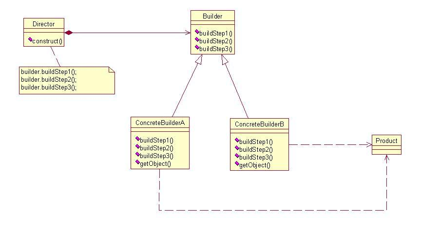
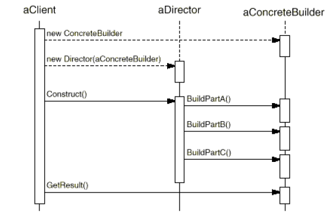
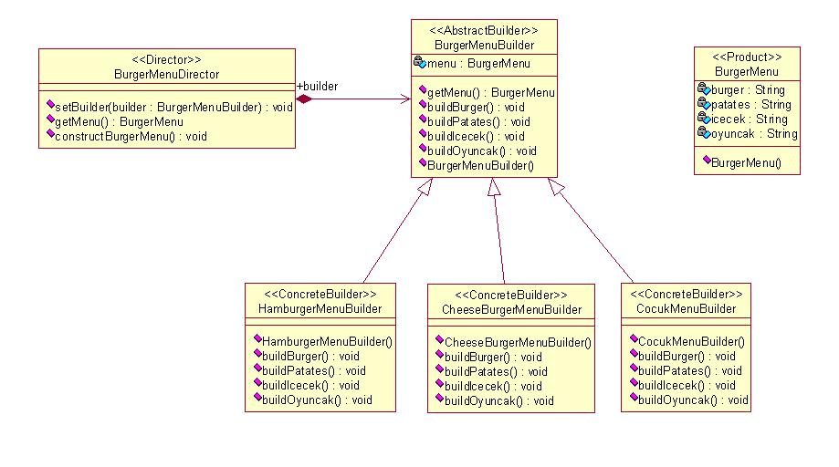

# Builder Pattern

Bu yazı **Hacettepe BBM** sınıfında 2004-2008 yılları arasında okurken *Tasarım Örüntüleri* dersinde o zamanki hocamız olan *Ebru SEZER*'in yardımcı kaynak olarak verdiği slaytlar üzerinden düzenlenmiştir.

## Builder Pattern

- Adından da anlaşılacağı gibi nesneleri oluşturmak/yaratmak için kullanılan bir örüntüdür.
- Amacı basit nesnelerin oluşturduğu karmaşık nesnelerin, oluşturulmasını ve gösterimini ayırmaktır.
- Aynı oluşturma işlemi farklı gösterimler yaratabilir.
- Örüntü ile istemci nesneye sadece “type” ve “content” belirleyerek karmaşık nesne yaratma imkanı sağlanır. İstemci, karmaşık nesnenin ne şekilde (hangi adımlar ile) yaratıldığından soyutlanmış olur.

- Tüm farklı “builder class” ları genellikle abstract bir Builder sınıfından *kalıt alır*lar; abstractBuilder sınıfının içerisinde nesnenin parçalarını oluşturmakta kullanılan ileti tanımları bulunur.
- *abstractBuilder* iletileri *Director* da bulunan **construct()** iletisi içerisinde sıra ile çağırılırlar. 

Örüntünün anlaşılması için tasarlanan *Sınıf Şeması* aşağıdaki gibidir



Bu sınıfların ne işe yaradığı da aşağıda belirtilmiştir.

- **Builder**  
  - *Product* nesnesine ait parçaların yaratılmasına ilişkin soyut bir arayüz tanımlar.

- **ConcreteBuilder**  
  - Builder arayüzünü gerçekleştirerek *Product*’a ait parçaları oluşturur.
  - Yarattığı gösterimi tanımlar ve saklar.
  - Product nesnesini alıp kullanabilmek için bir arayüz sağlar.

- **Director**  
  - Director sınıfı nesnenin yaratılması sırasında uygulanacak sıralamayı düzenlemek ile sorumludur. Parametre olarak bir *ConcreteBuilder* alır ve bunun üzerinde gerekli işlemleri gerçekleştirir.

- **Product**  
  - Oluşturulan karmaşık nesneyi temsil eder. *ConcreteBuilder* nesneye ait içsel gösterimi oluşturur ve bu oluşturma/birleştirme işlemi sırasında bütünü oluşturmakta kullanılan parçalara ait tanımları içerir.

Sınıfların *Ardıl İşlem Çizeneği* aşağıda gösterilmiştir.



Bu sınıflarla ilgili olarak hazırlanmış örnek kodlar da aşağıdaki gibidir;

**Product** sınıfı:
```java
class BurgerMenu {
  private String burger = "";
  private String patates = "";
  private String icecek = "";
  private String oyuncak = "";

  public void setBurger(String burger) { this.burger = burger; }
  public void setPatates(String patates) { this.patates = patates; }
  public void setIcecek(String icecek)  { this.icecek = icecek;}
  public void setOyuncak(String oyuncak) { this.oyuncak = oyuncak;}
}
```

**Abstract Builder** sınıfı:
```java
abstract class BurgerMenuBuilder {
  protected BurgerMenu menu;

  public BurgerMenu getMenu() { return menu; }
  public void createMenu() { menu = new BurgerMenu(); }

  public abstract void buildBurger();
  public abstract void buildPatates();
  public abstract void buildIcecek();
  public abstract void buildOyuncak();
}
```

**Concrete Builder** sınıfı (Örnek 1):
```java
public class HamburgerMenuBuilder extends BurgerMenuBuilder {
  public void buildBurger() { menu.setBurger("ekmek + köfte"); }
  public void buildPatates() { menu.setPatates("çubuk patates"); }
  public void buildIcecek() { menu.setIcecek("orta boy kola"); }
  public void buildOyuncak() { menu.setOyuncak(null); }
}
```

**Concrete Builder** sınıfı (Örnek 2):
```java
public class CheeseBurgerMenuBuilder extends BurgerMenuBuilder {
  public void buildBurger() { menu.setBurger("ekmek + köfte + peynir"); }
  public void buildPatates() { menu.setPatates("çubuk patates"); }
  public void buildIcecek() { menu.setIcecek("orta boy kola"); }
  public void buildOyuncak() { menu.setOyuncak(null); }
}
```

**Concrete Builder** sınıfı (Örnek 3):
```java
public class CocukMenuBuilder extends BurgerMenuBuilder {
  public void buildBurger() { menu.setBurger("küçük ekmek + köfte"); }
  public void buildPatates() { menu.setPatates("elma dilimli patates"); }
  public void buildIcecek() { menu.setIcecek("meyve suyu"); }
  public void buildOyuncak() { menu.setOyuncak("Action Man"); }
}
```

**Director** sınıfı:
```java
public class BurgerMenuDirector {
  private BurgerMenuBuilder builder;
  public void setBuilder (BurgerMenuBuilder builder) { 
    builder = builder; 
  }
  public BurgerMenu getMenu() { 
    return builder.getMenu(); 
  }
  public void constructBurgerMenu() {
    builder.createMenu();
    builder.buildBurger();
    builder.buildPatates();
    builder.buildIcecek();
    builder.buildOyuncak();
  }
}
```

**Client** sınıfı:
```java
public class Client {
  public static void main(String[] args) {
    BurgerMenuDirector director = new BurgerMenuDirector();

    BurgerMenuBuilder hamburgerMenuBuilder = new HamburgerMenuBuilder();
    BurgerMenuBuilder cheeseBurgerMenuBuilder = new CheeseBurgerMenuBuilder();
    BurgerMenuBuilder cocukMenuBuilder = new CocukMenuBuilder();

    director.setBuilder(hamburgerMenuBuilder);
    director.constructBurgerMenu();
    BurgerMenu hamburgerMenu = director.getMenu();

    director.setBuilder(cheeseBurgerMenuBuilder);
    director.constructBurgerMenu();
    BurgerMenu cheseburgerMenu = director.getMenu();

    director.setBuilder(cocukMenuBuilder);
    director.constructBurgerMenu();
    BurgerMenu cocukMenu = director.getMenu();
   }
}
```
Yukarıda kaynak kod olarak tanımlanan sınıfların ilişki şeması da aşağıda gösterilmiştir.



##### Başka Bir Örnek (E-Posta) Yapısı

**E-Mail** sınıfı:
```cs
public class Email
{
  public string To { get; set; }
  public string From { get; set; }
  public string Subject { get; set; }
  public string Body { get; set; }
}
```

**E-Mail Builder** sınıfı:
```cs
public class EmailBuilder
{
  private readonly Email _email;
  public EmailBuilder()
  {
    _email = new Email();
  }

  public EmailBuilder To(string address)
  {
    _email.To = address;
    return this;
  }

  public EmailBuilder From(string address)
  {
    _email.From = address;
    return this;
  }

  public EmailBuilder Subject(string title)
  {
    _email.Subject = title;
    return this;
  }

  public EmailBuilder Body(string content)
  {
    _email.Body = content;
    return this;
  }

  public Email Build()
  {
    return _email;
  }
}
```

**Kullanım Örneği**:
```cs
var emailBuilder = new EmailBuilder();
var email = emailBuilder
  .To("serdargul@outlook.com")
  .From("baristunar@gmail.com")
  .Subject("Builder Pattern")
  .Body("Commit message")
  .Build();
```

Bu tasarım örüntüsün avantajları da aşağıda belirtilmiştir.

- Karmaşık bir nesnenin nasıl yaratıldığı gizlenmiş olur.
- Nesnelerin çok basamaklı ve farklı şekillerde oluşturulmasına imkan sağlar. (**Tek basamaklı Factory** ile kıyaslandığında)
- *Product*’ın içsel gösterimini istemciden gizler.
- Nesnenin oluşturulması *Factory*’ye kıyaslandığında daha çok alan bilgisi gerektirir.

Diğer bir tasarım örüntüsü olan Abstract Factory ile karşılaştırmasına bakacak olursak

| Builder Örüntüsü      | Abstract Factory Örüntüsü |
| ----------- | ----------- |
| Yapılan şeyin nasıl yapıldığı ile ilgilenir.| Yapılan şeyin ne olduğu ile ilgilenir.|
| Yapılacak karmaşık şeyin mantığı Builder da tutulur ve istemciden gizlenir. İstemci  belirli bir yapılandırma istediğinde, bu gösterimin oluşturulmasını Builder yönetir.| Nesnenin hangi tipte olacağı gibi bir seçenek varsa bu run-time’da belli olur. İstemci belirli bir yapılandırmadan ziyade genel özellikleri olan bir arayüz tipindeki nesneyi kullanır. |