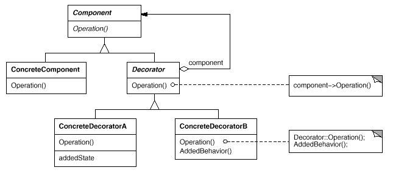
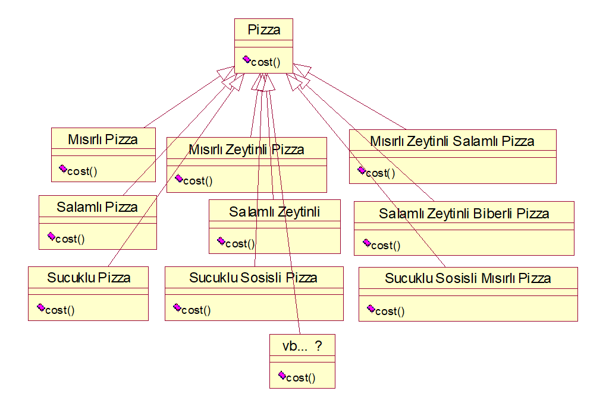
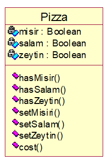
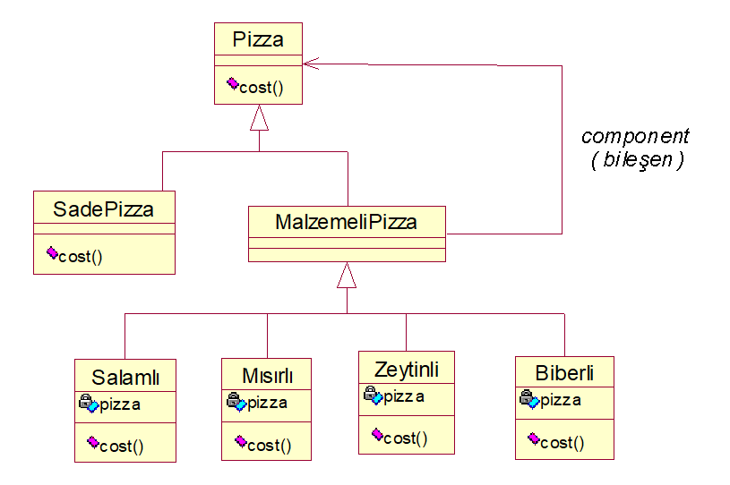

# Decorator Pattern

Bu yazı **Hacettepe BBM** sınıfında 2004-2008 yılları arasında okurken *Tasarım Örüntüleri* dersinde o zamanki hocamız olan *Ebru SEZER*'in yardımcı kaynak olarak verdiği slaytlar üzerinden düzenlenmiştir.

## Decorator Pattern

- Decorator pattern yapısal bir tasarım örüntüsüdür.
- Nesnelerin ve sınıfların daha büyük yapıları oluşturmak için nasıl ele alınacağı yapısal tasarım örüntülerinin ilgi alanıdır. 
- Bir nesneye dinamik olarak ek sorumluluklar eklemek için kullanılır.
- Kalıtım için alt sınıf oluşturmaktan daha esnek bir alternatif çözümdür.
- Ambalaj kağıdı gibi sarmalayan ama şeffaf olan bir yapı gibi düşünülebilir.

Örüntünün anlaşılması için tasarlanan *Sınıf Şeması* aşağıdaki gibidir



Bu sınıfların ne işe yaradığı da aşağıda belirtilmiştir.

- **Component (Bileşen)**  
  - Dinamik olarak sorumluluklar eklenebilecek nesneler için arayüz tanımıdır.

- **ConcreteComponent (Somut Bileşen)**  
  - Ek sorumlulukların eklenebileceği nesne tanımıdır

- **Decorator**  
  - Bir *Bileşen* nesnesine bir referans sağlar ve Bileşenin arayüzüne uyan bir arayüz tanımlar.

- **ConcreteDecorator**  
  - *Bileşen* nesnesine ek sorumluluklar ekler

Genel olarak bu örüntüyü örneklendirmek için **Pizza** problemi ve çözümü verilir.

#### Problem

- Pizzanız neli olsun ?
- Çok malzeme seçeneği var !
  - Sosis, mısır, salam, biber, vb.
- Her müşteri farklı malzemeden farklı porsiyonda isteyebilir.
  - Mısırlı, salamlı ve biberli ama biberi bol olsun! (Yani 2 porsiyon biber malzemesi konacak)

##### İlk Akla Gelen Çözüm



Bu çözümle ilgili olarak hazırlanmış örnek kodlar da aşağıdaki gibidir;

```java
class BurgerMenu {
  public abstract class Pizza {
      public abstract double cost();
  }

  public class MısırlıPz extends Pizza{
        public double cost(){
              return 0.8;
      }
  }

  public class MısırlıZeytinliPz extends Pizza{
      public double cost(){
              return 1.4;
      }
  }

  public class MısırlıZeytinliSalamlıPz extends Pizza{
        public double cost(){
              return 2.1;
        }
  }
}

public class Mc {
  public static void main(String[] args) {
    MısırlıPz msrPiz = new MisirliPz();
    MısırlıZeytinliPz  msrZeyPiz  =  new  MisirliZeytinliPz();
    MısırlıZeytinliSalamliPz  msrZeySalPiz  =  new MisirliZeytinliSalamliPz();
  }
}
```

###### Peki Bu Çözüm Neden Uygun Değil?

- Sınıf sayısı fazla
- Kodda değişiklik yapmak zor
  - *Zeytinin fiyatı değişirse, içinde zeytin olan tüm sınıfların değişmesi gerekir.*

##### 2. Çözüm



##### 3. Çözüm



**Pizza** sınıfı:
```java
public abstract class Pizza {
  public abstract double cost();
}
```

**Malzemeli Pizza** sınıfı:
```java
public abstract class MalzemeliPizza extends Pizza{
  /*...*/
}
```

**Salamlı Pizza** sınıfı:
```java
public class Salamli extends MalzemeliPizza{
  protected Pizza pizza;
  public Zeytinli(Pizza pizza){
    this.pizza = pizza;
  }     
  public double cost(){
    return 2.6 + pizza.cost();
  }
}
```

**Zeytinli Pizza** sınıfı:
```java
public class Zeytinli extends MalzemeliPizza{
  protected Pizza pizza;
  public Zeytinli(Pizza pizza){
    this.pizza = pizza;
  }
  public double cost(){
    return 1.3 + pizza.cost();
  }
}
```

**Mısırlı Pizza** sınıfı:
```java
public class Misirli extends MalzemeliPizza{
  protected Pizza pizza;
  public Zeytinli(Pizza pizza){
    this.pizza = pizza;
  }
  public double cost(){
    return 1.8 + pizza.cost();
  }
}
```

**Dominos Pizza** sınıfı:
```java
public classDominosPizza{
  Pizza pizza = new SadePizza();
  System.out.println(pizza.cost());

  Pizza pizza2 = new SadePizza();
  pizza2 = Salamli(pizza2);
  pizza2 = Zeytinli(pizza2);
  pizza2 = Misirli(pizza2);
  System.out.println(pizza2.cost());

  Pizza pizza3 = new SadePizza();
  pizza3 = Salamli(pizza3);
  pizza3 = Salamli(pizza3);
  pizza3 = Misirli(pizza3);	
  System.out.println(pizza3.cost());
}
```

###### Peki Bu Kodun Avantajları Nelerdir?

- Diğer çözüme göre daha az sınıf
- Malzeme ekleme/çıkarma daha kolay
  -  `public class YeniMalzeme extends MalzemeliPizza{...}`
- Pizzada her çeşit malzeme bir arada bulunabilir.
  - *Her ne kadar sadece malzemeler tekil tanımlanmış ise de..*

Bu örüntünün avantaj ve dezavantajlarına bakacak olursak

| Avantajları      | Dezavantajları |
| ----------- | ----------- |
| Statik kalıtımla nesnelere eklenen yetenekler (davranışlar), bu örüntü ile çalışma zamanında (yeni yetenekler eklenerek/çıkartılarak) çok daha esnek bir şekilde yapılabilir.|Bir decorator ve onun bileşeni eş değildir| 
|Sınıflara yeni yetenekler eklenirken kullandığın kadar öde ( pay-as-you-go ) mantığıyla hareket edilir. Böylece bütün olası özellikleri destekleyebilecek karmaşık ( complex ) ve özelleşmiş ( customizable ) bir sınıf yerine, daha basit bir sınıf tanımlar ve Decorator nesneleriyle yeni yetenekler ekleriz.| Fazla sayıda küçük sınıf tanımlanması gerekebilir. |


###### Bu Örüntü Ne Zaman Kullanılmalı?

- Diğer nesneleri etkilemeden, her nesneye yeni yetenekler eklemek ama bunu dinamik ve aynı arayüz ile yapmak için... 
- Çıkartılabilir/eklenebilir yetenekler için...
- Her yeni ekleme için altsınıf yapmak pratik değilse...