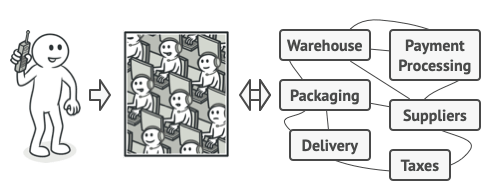
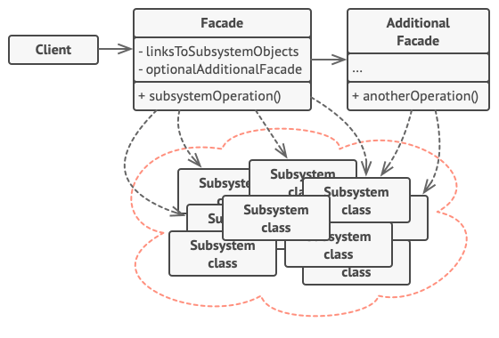
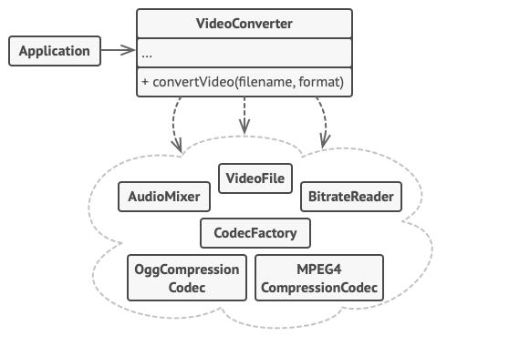

# Facade Pattern

---

Bu yazı [refactoring.guru](https://refactoring.guru/design-patterns/facade)'dan çevirilmiş.

---

## Amaç

`Facade`, bir library, framework veya diğer herhangi bir karmaşık sınıf grubuna basitleştirilmiş bir arayüz sağlayan yapısal bir tasarım modelidir.


## Problem

Kodunuzu, karmaşık bir library veya framework ait geniş bir nesne kümesiyle çalıştırmanız gerektiğini hayal edin. Normalde, tüm bu nesneleri başlatmanız, bağımlılıkları takip etmeniz, yöntemleri doğru sırada yürütmeniz vb. gerekir.

Sonuç olarak, sınıflarınızın iş mantığı, 3. taraf sınıfların uygulama ayrıntılarına sıkı sıkıya bağlı hale gelir ve bu da anlaşılmasını ve sürdürülmesini zorlaştırır.

## Çözüm

Facade, çok sayıda hareketli parça içeren karmaşık bir alt sisteme basit bir arayüz sağlayan bir sınıftır. Bir facade, doğrudan alt sistemle çalışmaya kıyasla sınırlı işlevsellik sağlayabilir. Ancak, yalnızca müşterilerin gerçekten önemsediği özellikleri içerir.

Bir facade sahip olmak, uygulamanızı düzinelerce özelliğe sahip gelişmiş bir library ile entegre etmeniz gerektiğinde kullanışlıdır, ancak yalnızca işlevselliğinin küçük bir kısmına ihtiyacınız vardır.

Örneğin, kedilerin olduğu kısa komik videoları sosyal medyaya yükleyen bir uygulama, potansiyel olarak profesyonel bir video dönüştürme library kullanabilir. Ancak, gerçekten ihtiyacı olan tek yöntem `encode(filename, format)` olan bir sınıftır. Böyle bir sınıf oluşturduktan ve onu video dönüştürme library'e bağladıktan sonra ilk facade'e sahip olacaksınız.

## Gerçek Dünya Analojisi



*<p align="center">Telefonla sipariş verme.</p>*

Telefonla sipariş vermek için bir mağazayı aradığınızda, operatör, mağazanın tüm hizmetlerine ve departmanlarına erişmek için cephedir(facade). Operatör, sipariş sistemi, ödeme ağ geçitleri ve çeşitli teslimat hizmetleri için size basit bir ses arabirimi sağlar.

## Yapı (Structure)



*1.* `Facade`, alt sistemin işlevselliğinin belirli bir bölümüne kolay erişim sağlar. Müşterinin talebini nereye yönlendireceğini ve tüm hareketli parçaları nasıl çalıştıracağını bilir.

*2.* Tek bir facade, onu başka bir karmaşık yapı haline getirebilecek ilgisiz özelliklerle kirletmesini önlemek için bir `Additional Facade` sınıfı oluşturulabilir. Additional Facades hem müşteriler hem de diğer facades tarafından kullanılabilir.

*3.* Karmaşık Alt Sistem (`Complex Subsystem`), düzinelerce çeşitli nesneden oluşur. Hepsinin anlamlı bir şey yapmasını sağlamak için, nesneleri doğru sırada başlatmak ve onlara uygun biçimde veri sağlamak gibi alt sistemin uygulama ayrıntılarına derinlemesine dalmanız gerekir.

Alt sistem sınıfları (Subsystem classes), facade varlığından haberdar değildir. Sistem içinde çalışırlar ve birbirleriyle doğrudan çalışırlar.

*4.* `Client`, alt sistem nesnelerini doğrudan çağırmak yerine facade kullanır.

## Sözde Kod (Pseudocode)

Bu örnekte, Facade pattern, karmaşık bir video dönüştürme framework etkileşimini basitleştirir.



*<p align="center">Tek bir facade sınıfında birden çok bağımlılığı ayırma örneği.</p>*

Kodunuzu düzinelerce framework sınıfıyla doğrudan çalıştırmak yerine, bu işlevselliği kapsayan (encapsulate) ve onu kodun geri kalanından gizleyen bir facade sınıfı yaratırsınız. Bu yapı aynı zamanda çerçevenin gelecekteki sürümlerine yükseltme veya onu bir başkasıyla değiştirme çabasını en aza indirmenize yardımcı olur. Uygulamanızda değiştirmeniz gereken tek şey, cephe yöntemlerinin uygulanması olacaktır.

```js
// These are some of the classes of a complex 3rd-party video
// conversion framework. We don't control that code, therefore
// can't simplify it.

class VideoFile
// ...

class OggCompressionCodec
// ...

class MPEG4CompressionCodec
// ...

class CodecFactory
// ...

class BitrateReader
// ...

class AudioMixer
// ...


// We create a facade class to hide the framework's complexity
// behind a simple interface. It's a trade-off between
// functionality and simplicity.
class VideoConverter is
    method convert(filename, format):File is
        file = new VideoFile(filename)
        sourceCodec = new CodecFactory.extract(file)
        if (format == "mp4")
            destinationCodec = new MPEG4CompressionCodec()
        else
            destinationCodec = new OggCompressionCodec()
        buffer = BitrateReader.read(filename, sourceCodec)
        result = BitrateReader.convert(buffer, destinationCodec)
        result = (new AudioMixer()).fix(result)
        return new File(result)

// Application classes don't depend on a billion classes
// provided by the complex framework. Also, if you decide to
// switch frameworks, you only need to rewrite the facade class.
class Application is
    method main() is
        convertor = new VideoConverter()
        mp4 = convertor.convert("funny-cats-video.ogg", "mp4")
        mp4.save()
```

## Uygulanabilirlik (Applicability)

*<b>Karmaşık bir alt sisteme sınırlı ancak basit bir arayüze ihtiyacınız olduğunda facade pattern kullanın.</b>*

Çoğu zaman, alt sistemler zamanla daha karmaşık hale gelir. Design pattern uygulamak bile tipik olarak daha fazla sınıf oluşturmaya yol açar. Bir alt sistem daha esnek hale gelebilir ve çeşitli bağlamlarda yeniden kullanımı daha kolay olabilir, ancak bir istemciden talep ettiği yapılandırma ve ortak kod miktarı giderek büyür. Facade, istemci gereksinimlerinin çoğuna uyan alt sistemin en çok kullanılan özelliklerine bir kısayol sağlayarak bu sorunu çözmeye çalışır.

*<b>Bir alt sistemi katmanlar halinde yapılandırmak istediğinizde Facade kullanın.</b>*

Bir alt sistemin her düzeyine giriş noktaları tanımlamak için facade oluşturun. Yalnızca facade aracılığıyla iletişim kurmalarını gerektirerek birden çok alt sistem arasındaki bağlantıyı azaltabilirsiniz.

Örneğin, video dönüştürme framework'üne dönelim. İki katmana ayrılabilir: video ve sesle ilgili. Her katman için bir facade oluşturabilir ve ardından her katmanın sınıflarının bu facades aracılığıyla birbirleriyle iletişim kurmasını sağlayabilirsiniz. Bu yaklaşım, [Mediator](https://refactoring.guru/design-patterns/mediator) pattern'e çok benziyor.

## Nasıl Uygulanır?

*1.* Mevcut bir alt sistemin (subsystem) sağladığından daha basit bir arayüz sağlamanın mümkün olup olmadığını kontrol edin. Bu arabirim (interface), client code'unu birçok alt sistem sınıfından bağımsız hale getiriyorsa doğru yoldasınız.

*2.* Bu arabirimi yeni bir facade sınıfında bildirin (declare) ve uygulayın (implement). Facade, client code'dan gelen çağrıları alt sistemin uygun nesnelerine yönlendirmelidir. Cephe, alt sistemi başlatmaktan ve client code zaten bunu yapmıyorsa, daha sonraki yaşam döngüsünü yönetmekten sorumlu olmalıdır.

*3.* Modelden tam olarak yararlanmak için, tüm client code'un alt sistemle yalnızca facade üzerinden iletişim kurmasını sağlayın. Artık client code, alt sistem kodundaki herhangi bir değişiklikten korunmaktadır. Örneğin, bir alt sistem yeni bir sürüme yükseltildiğinde, yalnızca facade'ki kodu değiştirmeniz gerekecektir.

*4.* Facade çok büyürse ([too big](https://refactoring.guru/smells/large-class)), davranışının bir kısmını yeni, rafine bir facade sınıfına çıkarmayı düşünün.

## Artılar ve Eksiler

✓ Kodunuzu bir alt sistemin karmaşıklığından ayırabilirsiniz.

✗ Bir facade, bir uygulamanın tüm sınıflarına bağlı [a god object](https://en.wikipedia.org/wiki/God_object) olabilir.

## Diğer Paternlerle İlişkiler

- [Facade](https://refactoring.guru/design-patterns/facade), mevcut nesneler için yeni bir arayüz tanımlarken, [Adapter](https://refactoring.guru/design-patterns/adapter) mevcut arayüzü kullanılabilir hale getirmeye çalışır. Adapter genellikle yalnızca bir nesneyi sararken, Facade tüm bir nesne alt sistemiyle çalışır.

- [Abstract Factory](https://refactoring.guru/design-patterns/abstract-factory), yalnızca alt sistem nesnelerinin oluşturulma şeklini client code'unu gizlemek istediğinizde [Facade](https://refactoring.guru/design-patterns/facade) bir alternatif olarak hizmet edebilir.

- [Flyweight](https://refactoring.guru/design-patterns/flyweight), çok sayıda küçük nesnenin nasıl yapıldığını gösterirken [Facade](https://refactoring.guru/design-patterns/facade), tüm bir alt sistemi temsil eden tek bir nesnenin nasıl yapıldığını gösterir.

- [Facade](https://refactoring.guru/design-patterns/facade) ve [Mediator](https://refactoring.guru/design-patterns/mediator) benzer işlere sahiptir: sıkı bir şekilde birleşmiş çok sayıda sınıf arasında işbirliğini organize etmeye çalışırlar.

    - Facade, nesnelerin bir alt sistemine basitleştirilmiş bir arayüz tanımlar, ancak herhangi bir yeni işlevsellik getirmez. Alt sistemin kendisi facade'den habersizdir. Alt sistem içindeki nesneler doğrudan iletişim kurabilir.

    - Mediator, sistemin bileşenleri arasındaki iletişimi merkezileştirir. Bileşenler yalnızca mediator nesneyi bilir ve doğrudan iletişim kurmaz.

- Çoğu durumda tek bir facade nesnesi yeterli olduğundan, bir [Facade](https://refactoring.guru/design-patterns/facade) sınıfı genellikle bir [Singleton](https://refactoring.guru/design-patterns/singleton)'a dönüştürülebilir.

- [Facade](https://refactoring.guru/design-patterns/facade), hem karmaşık bir varlığı tamponlaması hem de kendi başına başlatması bakımından [Proxy](https://refactoring.guru/design-patterns/proxy)'ye benzer. Facade'den farklı olarak Proxy, hizmet nesnesiyle aynı arabirime sahiptir ve bu da onları değiştirilebilir hale getirir.