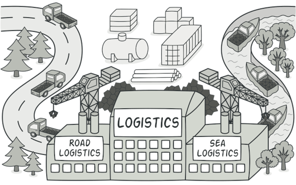
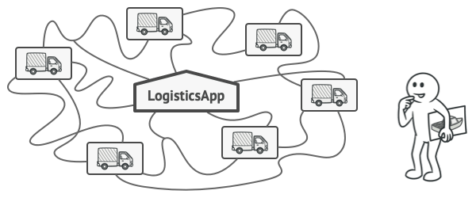
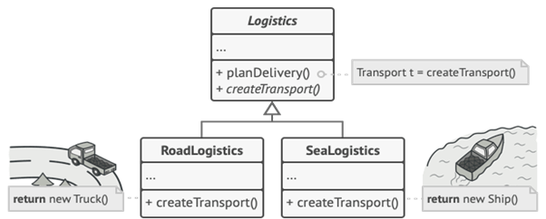
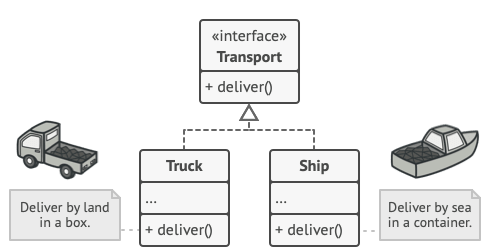
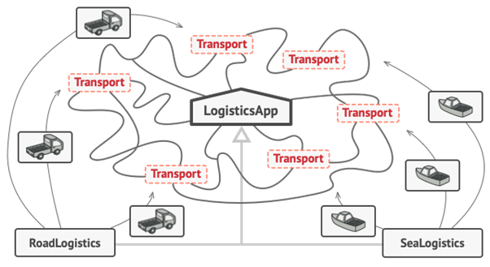
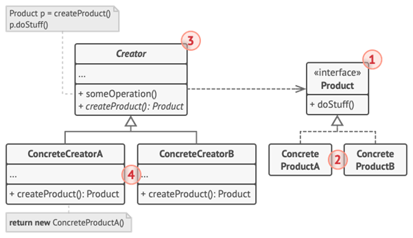
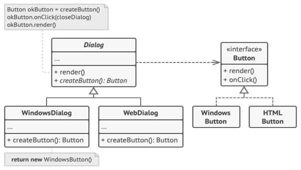

# Factory Method
Ayrıca şu şekilde de bilinir: Sanal Yapıcı
---

Bu yazı [refactoring.guru](https://refactoring.guru/design-patterns/factory-method) kaynağından çeviri yapılarak hazırlanmıştır.

---

## Amaç

Factory Method, bir üst sınıfta nesneler oluşturmak için bir arabirim sağlayan, ancak alt sınıfların oluşturulacak nesnelerin türünü değiştirmesine izin veren oluşturmacı bir tasarım kalıbıdır.




## Problem

Bir lojistik yönetim uygulaması oluşturduğunuzu hayal edin. Uygulamanızın ilk sürümü yalnızca kamyonlarla taşımayı gerçekleştirebilir, bu nedenle kodunuzun büyük kısmı 'Truck' sınıfında bulunur.

Bir süre sonra uygulamanız oldukça popüler hale geliyor. Her gün deniz taşımacılığı şirketlerinden deniz lojistiğini uygulamaya dahil etmek için onlarca talep alıyorsunuz.



*<p align="center">Kodun geri kalanı zaten mevcut sınıflarla birleştirilmişse, programa yeni bir sınıf eklemek o kadar kolay değildir.</p>*

Harika bir haber, değil mi? Peki ya kod? Şu anda kodunuzun çoğu Truck sınıfına bağlı. Uygulamaya Ships (Gemiler) eklemek, tüm kod tabanında değişiklik yapılmasını gerektirir. Ayrıca, daha sonra uygulamaya başka bir ulaşım türü eklemeye karar verirseniz, muhtemelen tüm bu değişiklikleri tekrar yapmanız gerekecektir.

Sonuç olarak, ulaşım nesnelerinin sınıfına bağlı olarak uygulamanın davranışını değiştiren koşullarla dolu oldukça kötü bir kodla karşılaşacaksınız.


## Çözüm

Fabrika Yöntemi modeli, doğrudan nesne oluşturma çağrılarını (yeni operatörü kullanarak) özel bir fabrika yöntemine yapılan çağrılarla değiştirmenizi önerir. Endişelenmeyin: nesneler hala 'new' operatörü aracılığıyla oluşturulur, ancak fabrika yönteminden çağrılır. Bir fabrika yöntemiyle döndürülen nesnelere genellikle ürün denir.



*<p align="center">Alt sınıflar, fabrika yöntemiyle döndürülen nesnelerin sınıfını değiştirebilir.</p>*

İlk bakışta, bu değişiklik anlamsız görünebilir: yapıcı çağrısını programın bir bölümünden diğerine taşıdık. Ancak şunu göz önünde bulundurun: artık bir alt sınıfta fabrika yöntemini geçersiz kılabilir ve yöntem tarafından oluşturulan ürünlerin sınıfını değiştirebilirsiniz.

Yine de küçük bir sınırlama vardır: alt sınıflar, yalnızca bu ürünler ortak bir temel sınıfa veya arabirime sahipse farklı türde ürünler döndürebilir. Ayrıca, temel sınıftaki fabrika yönteminin dönüş türü bu arabirim olarak bildirilmelidir.



*<p align="center">Tüm ürünler aynı arayüzü takip etmelidir.</p>*

Örneğin, hem Truck hem de Ship sınıfları, deliver adlı bir yöntem bildiren Transport arabirimini uygulamalıdır. Her sınıf bu yöntemi farklı şekilde uygular: kamyonlar kargoyu karadan, gemiler kargoyu denizden teslim eder. RoadLogistics sınıfındaki fabrika yöntemi kamyon nesnelerini döndürürken, SeaLogistics sınıfındaki fabrika yöntemi gemileri döndürür.



*<p align="center">Tüm ürün sınıfları ortak bir arabirim uyguladığı sürece, nesnelerini bozmadan istemci koduna iletebilirsiniz.</p>*

## Yapı



1.	Ürün, yaratıcısı ve alt sınıfları tarafından üretilebilen tüm nesneler için ortak olan arabirimi bildirir.
2.	Beton Ürünler, ürün arayüzünün farklı uygulamalarıdır.
3.	Creator sınıfı, yeni ürün nesnelerini döndüren fabrika yöntemini bildirir. Bu yöntemin iade türünün ürün arayüzüyle eşleşmesi önemlidir.
Tüm alt sınıfları yöntemin kendi sürümlerini uygulamaya zorlamak için fabrika yöntemini soyut olarak ilan edebilirsiniz. Alternatif olarak, temel fabrika yöntemi bazı varsayılan ürün türlerini döndürebilir.
Adına rağmen, ürün oluşturmanın yaratıcının birincil sorumluluğu olmadığını unutmayın. Genellikle, içerik oluşturucu sınıfı zaten ürünlerle ilgili bazı temel iş mantığına sahiptir. Fabrika yöntemi, bu mantığı somut ürün sınıflarından ayırmaya yardımcı olur. İşte bir benzetme: Büyük bir yazılım geliştirme şirketinin programcılar için bir eğitim departmanı olabilir. Ancak, bir bütün olarak şirketin birincil işlevi hala programcı üretmek değil, kod yazmaktır.
4.	Beton Oluşturucular, temel fabrika yöntemini geçersiz kılar, böylece farklı türde bir ürün döndürür.

Factory Method tasarım kalıbında her zaman yeni örnekler oluşturması gerekmediğini unutmayın. Ayrıca bir önbellekten, nesne havuzundan veya başka bir kaynaktan var olan nesneleri de döndürebilir.

## Yalancı Kod

Bu örnek, istemci kodunu somut UI sınıflarına bağlamadan platformlar arası UI öğeleri oluşturmak için Fabrika Yönteminin nasıl kullanılabileceğini gösterir.



*<p align="center">Platformlar arası dialog örneği.</p>*

Temel Dialog sınıfı, penceresini oluşturmak için farklı UI öğelerini kullanır. Çeşitli işletim sistemlerinde bu öğeler biraz farklı görünebilir, ancak yine de tutarlı bir şekilde davranmalıdırlar. Windows'ta bir düğme, Linux'ta hala bir düğmedir.

Fabrika yöntemi devreye girdiğinde her işletim sistemi için Dialog sınıfının mantığını yeniden yazmanıza gerek yoktur. Temel Dialog sınıfı içinde düğmeler üreten bir fabrika yöntemi bildirirsek, daha sonra fabrika yönteminden Windows stili düğmeler döndüren bir alt sınıf oluşturabiliriz. Alt sınıf daha sonra kodun çoğunu temel sınıftan devralır, ancak fabrika yöntemi sayesinde ekranda Windows görünümlü düğmeler oluşturabilir.

Bu kalıbın çalışması için, temel Dialog sınıfının soyut düğmelerle çalışması gerekir: bir temel sınıf veya tüm somut düğmelerin izlediği bir arabirim. Bu şekilde, hangi tür düğmelerle çalışırsa çalışsın, Dialog içindeki kod işlevsel kalır.

Elbette bu yaklaşımı diğer UI öğelerine de uygulayabilirsiniz. Ancak, Dialog'a eklediğiniz her yeni fabrika yöntemi ile Soyut Fabrika modeline yaklaşırsınız. Korkmayın, bu model hakkında daha sonra konuşacağız.

```csharp

/*Oluşturucu sınıf, olması gereken fabrika yöntemini bildirir.
bir ürün sınıfının bir nesnesini döndürür. Yaratıcının alt sınıfları
genellikle bu yöntemin uygulanmasını sağlar.*/

class Dialog is

    /*Oluşturucu, fabrika metodu tasarım kalıbının bazı 
    varsayılan tanımlamalarını da sağlayabilir.*/

    abstract method createButton():Button

    /*Adına rağmen, içerik oluşturucunun birincil sorumluluğunun ürünler 
    oluşturmak olmadığını unutmayın. Genellikle fabrika metodu tasarım 
    kalıbıyla döndürülen ürün nesnelerine dayanan bazı temel iş mantığını içerir.
    Alt sınıflar, fabrika metodu tasarım kalıbını geçersiz kılarak ve ondan farklı 
    bir ürün türü döndürerek bu iş mantığını dolaylı olarak değiştirebilir.*/

    method render() is
        // Bir ürün nesnesi oluşturmak için fabrika metodu çağırın.
        Button okButton = createButton()
        // Şimdi ürünü kullanın.
        okButton.onClick(closeDialog)
        okButton.render()


/*Somut oluşturucular, ortaya çıkan ürünün türünü 
değiştirmek için fabrika metodunu ezer(override). */
class WindowsDialog extends Dialog is
    method createButton():Button is
        return new WindowsButton()

class WebDialog extends Dialog is
    method createButton():Button is
        return new HTMLButton()


/*Ürün arayüzü, tüm somut ürünlerin gerçekleştirmesi 
gereken işlemleri bildirir.*/
interface Button is
    method render()
    method onClick(f)

/* Somut ürünler, ürün arayüzünün çeşitli tanımlamalarını uygular sağlar.*/
class WindowsButton implements Button is
    method render(a, b) is
        // Windows stilinde bir düğme oluşturun.
    method onClick(f) is
        // Yerel bir işletim sistemi tıklama olayını bağlayın.

class HTMLButton implements Button is
    method render(a, b) is
        // Bir düğmenin HTML temsilini döndürür.
    method onClick(f) is
        // Bir web tarayıcısı tıklama olayını bağlayın.


class Application is
    field dialog: Dialog

    /*Uygulama, mevcut yapılandırmaya veya ortam ayarlarına 
    bağlı olarak bir içerik oluşturucunun türünü seçer.*/
    method initialize() is
        config = readApplicationConfigFile()

        if (config.OS == "Windows") then
            dialog = new WindowsDialog()
        else if (config.OS == "Web") then
            dialog = new WebDialog()
        else
            throw new Exception("Error! Unknown operating system.")

   /*İstemci kodu, temel arabirimi aracılığıyla da olsa somut 
   bir oluşturucu örneğiyle çalışır. İstemci, temel arabirim aracılığıyla 
   içerik oluşturucuyla çalışmaya devam ettiği sürece, onu herhangi bir 
   oluşturucunun alt sınıfından geçirebilirsiniz.*/
    method main() is
        this.initialize()
        dialog.render()


```

## Uygulanabilirlik 

`Kodunuzun birlikte çalışması gereken nesnelerin tam türlerini ve bağımlılıklarını önceden bilmiyorsanız Fabrika Yöntemini kullanın.`

Fabrika Yöntemi, ürün yapım kodunu, ürünü gerçekten kullanan koddan ayırır. Bu nedenle, ürün yapım kodunu kodun geri kalanından bağımsız olarak genişletmek daha kolaydır.

Örneğin, uygulamaya yeni bir ürün türü eklemek için yalnızca yeni bir içerik oluşturucu alt sınıfı oluşturmanız ve içindeki fabrika yöntemini geçersiz kılmanız gerekir.

`Kitaplığınızın veya çerçevenizin kullanıcılarına dahili bileşenlerini genişletmenin bir yolunu sağlamak istediğinizde Fabrika Metodu tasarım kalıbını kullanın.`

Kalıtım, muhtemelen bir kitaplığın veya çerçevenin varsayılan davranışını genişletmenin en kolay yoludur. Ancak çerçeve, standart bir bileşen yerine alt sınıfınızın kullanılması gerektiğini nasıl anlar?

Çözüm, çerçeve genelinde bileşenleri oluşturan kodu tek bir fabrika yöntemine indirgemek ve bileşenin kendisini genişletmenin yanı sıra herkesin bu yöntemi geçersiz kılmasına izin vermektir.

Bunun nasıl işe yarayacağını görelim. Açık kaynaklı bir UI çerçevesi kullanarak bir uygulama yazdığınızı hayal edin. Uygulamanızın yuvarlak düğmeleri olmalıdır, ancak çerçeve yalnızca kare düğmeler sağlar. Standart Button sınıfını muhteşem bir RoundButton alt sınıfıyla genişletirsiniz. Ancak şimdi ana UIFramework sınıfına varsayılan bir alt sınıf yerine yeni düğme alt sınıfını kullanmasını söylemeniz gerekiyor.

Bunu başarmak için, bir temel çerçeve sınıfından bir UIWithRoundButtons alt sınıfı oluşturur ve onun createButton yöntemini geçersiz kılarsınız. Bu yöntem, temel sınıftaki Button nesnelerini döndürürken, alt sınıfınızın RoundButton nesnelerini döndürmesini sağlarsınız. Şimdi UIFramework yerine UIWithRoundButtons sınıfını kullanın. Ve hepsi bu!

`Var olan nesneleri her seferinde yeniden oluşturmak yerine yeniden kullanarak sistem kaynaklarından tasarruf etmek istediğinizde Fabrika Yöntemini kullanın.`

Veritabanı bağlantıları, dosya sistemleri ve ağ kaynakları gibi büyük, yoğun kaynak kullanan nesnelerle uğraşırken bu gereksinimi sıklıkla yaşarsınız.

Mevcut bir nesneyi yeniden kullanmak için ne yapılması gerektiğini düşünelim:

1.	İlk olarak, oluşturulan tüm nesneleri takip etmek için bir miktar depolama alanı oluşturmanız gerekir.

2.	Birisi bir nesne istediğinde, program o havuzun içinde boş bir nesne aramalıdır.
… ve ardından müşteri koduna geri gönderin.

3.	Boş nesne yoksa, program yeni bir tane oluşturmalı (ve havuza eklemelidir).

Bu çok fazla kod! Ve programı yinelenen kodlarla kirletmemeniz için hepsi tek bir yere yerleştirilmelidir.

Muhtemelen bu kodun yerleştirilebileceği en bariz ve uygun yer, nesnelerini yeniden kullanmaya çalıştığımız sınıfın kurucusudur. Ancak, bir kurucu tanım gereği her zaman yeni nesneler döndürmelidir. Mevcut örnekleri döndüremez.

Bu nedenle, mevcut nesneleri yeniden kullanmanın yanı sıra yeni nesneler oluşturabilen düzenli bir yönteme sahip olmanız gerekir. Bu bir fabrika yöntemine çok benziyor.

## Nasıl Uygulanır

*1.*	Tüm ürünlerin aynı arayüzü takip etmesini sağlayın. Bu arabirim, her üründe anlamlı olan yöntemleri bildirmelidir.

*2.* Creator sınıfının içine boş bir fabrika yöntemi ekleyin. Yöntemin dönüş türü, ortak ürün arabirimiyle eşleşmelidir.

*3.*	İçerik oluşturucunun kodunda, ürün oluşturuculara yapılan tüm referansları bulun. Ürün oluşturma kodunu fabrika yöntemine çıkarırken bunları tek tek fabrika yöntemine yapılan çağrılarla değiştirin. İade edilen ürünün türünü kontrol etmek için fabrika yöntemine geçici bir parametre eklemeniz gerekebilir.Bu noktada fabrika yönteminin kodu oldukça çirkin görünebilir. Hangi ürün sınıfını somutlaştıracağını seçen büyük bir switch deyimi olabilir. Ama merak etmeyin, yakında düzelteceğiz.

*4.*	Şimdi, fabrika yönteminde listelenen her ürün türü için bir dizi yaratıcı alt sınıf oluşturun. Alt sınıflarda fabrika yöntemini geçersiz kılın ve temel yöntemden uygun yapı kodu bitlerini çıkarın.

*5.*	Çok fazla ürün türü varsa ve hepsi için alt sınıflar oluşturmak mantıklı değilse, alt sınıflarda temel sınıftan kontrol parametresini yeniden kullanabilirsiniz.

Örneğin, aşağıdaki sınıf hiyerarşisine sahip olduğunuzu düşünün: birkaç alt sınıfa sahip temel Mail sınıfı: AirMail ve GroundMail; Ulaştırma sınıfları Uçak, Kamyon ve Tren'dir. AirMail sınıfı yalnızca Uçak nesnelerini kullanırken, GroundMail hem Kamyon hem de Train nesneleri ile çalışabilir. Her iki durumu da ele almak için yeni bir alt sınıf (örneğin TrainMail) oluşturabilirsiniz, ancak başka bir seçenek daha var. İstemci kodu, hangi ürünü almak istediğini kontrol etmek için GroundMail sınıfının fabrika yöntemine bir argüman iletebilir.

*6.*	Tüm ekstraksiyonlardan sonra, temel fabrika yöntemi boşaldıysa, onu soyut hale getirebilirsiniz. Kalan bir şey varsa, bunu yöntemin varsayılan davranışı yapabilirsiniz.

## Artıları ve Eksileri

✅	Yaratıcı ve somut ürünler arasında sıkı bir bağ kurmaktan kaçınırsınız.

✅	Tek Sorumluluk İlkesi. Ürün oluşturma kodunu programda tek bir yere taşıyarak kodun desteklenmesini kolaylaştırabilirsiniz.

✅	Açık/Kapalı Prensibi. Mevcut müşteri kodunu bozmadan programa yeni ürün türlerini tanıtabilirsiniz.

❌	Modeli uygulamak için birçok yeni alt sınıf tanıtmanız gerektiğinden kod daha karmaşık hale gelebilir. En iyi durum senaryosu, kalıbı mevcut bir içerik oluşturucu sınıfları hiyerarşisine dahil ettiğiniz zamandır.

## Diğer Kalıplarla İlişkiler

●	Birçok tasarım, Fabrika Metodu (daha az karmaşık ve alt sınıflar aracılığıyla daha fazla özelleştirilebilir) kullanılarak başlar ve Soyut Fabrika, Prototip veya Oluşturucu (daha esnek, ancak daha karmaşık) olarak gelişir.

●	Soyut Fabrika sınıfları genellikle bir dizi Fabrika Yöntemine dayanır, ancak bu sınıflarda yöntemleri oluşturmak için Prototip'i de kullanabilirsiniz.

●	Koleksiyon alt sınıflarının koleksiyonlarla uyumlu farklı türde yineleyiciler döndürmesine izin vermek için Fabrika Yöntemini Yineleyici ile birlikte kullanabilirsiniz.

●	Prototip kalıtım üzerine kurulu değildir, dolayısıyla dezavantajları da yoktur. Öte yandan, Prototip, klonlanmış nesnenin karmaşık bir şekilde başlatılmasını gerektirir. Fabrika Yöntemi, kalıtımı temel alır ancak bir başlatma adımı gerektirmez.

●	Fabrika Yöntemi, Şablon Yönteminin bir uzmanlığıdır. Aynı zamanda, bir Fabrika Yöntemi, büyük bir Şablon Yönteminde bir adım olarak hizmet edebilir.


