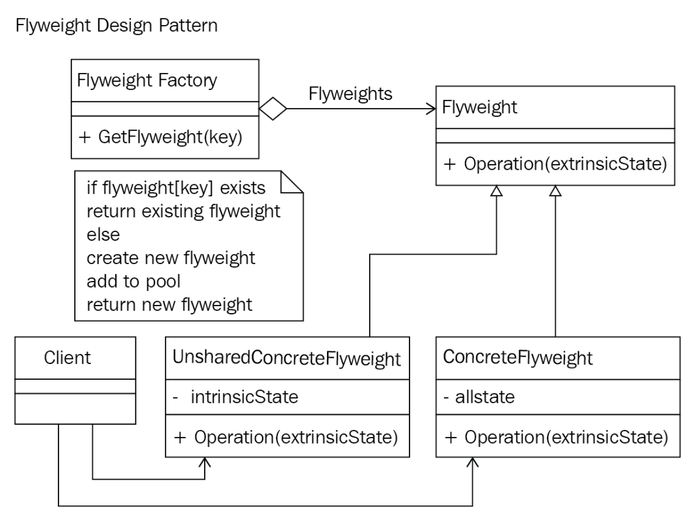

# Flyweight Pattern

Bu yazı [Clean Code In C#](https://www.packtpub.com/product/clean-code-in-c/9781838982973) adlı kitapta bulunan notlar üzerinden derlenmiştir.

## Flyweight Pattern

- Çok sayıda ayrıntılı nesnenin daha etkili bir şekilde işlenerek toplam nesne sayısının azaltılması için hazırlanmış bir tasarım örüntüsüdür.
- Performans artırımı ve oluşturulacak nesne sayısının azaltılması için kullanılır.

Temel yapısı aşağıdaki gibidir



Bu diyagramdaki sınıfların ilişkisi aşağıdaki gibidir.

- **Flyweight**, Flyweight bir arayüz (*interface*) sınıfıdır ve nesnenin doğasında olmayan bir durumun tespit edip ona göre işlem yapılması için tasarlanmıştır
- **ConcreteFlyweight** Flyweight sınıfından türetilmiştir ve nesnenin doğasında olan bir durum için bellek eklenmesini sağlar
- **UnsharedConcreteFlyweight** Flyweight nesnelerinin paylaşılmasına gerek yoksa bu sınıf kullanılır.
- **FlyweightFactory**, Flyweight nesnelerinin toplandığı ve paylaşıldığı sınıftır
- **Client**, Flyweight nesne referanslarının tutulduğu, ve bu nesnelerin doğasında olmayan durumların hesaplanıp saklandığı sınıftır.

Aşağıda bununla ilgili örnek kod blokları tanıtılacaktır.
ir;

**Flyweight** sınıfı:
```csharp
public abstract class Flyweight {
  public abstract void Operation(string extrinsicState);
}
```

**Concrete Flyweight** sınıfı:
```csharp
public class ConcreteFlyweight : Flyweight
{
  public override void Operation(string extrinsicState)
  {
    Console.WriteLine($"ConcreteFlyweight: {extrinsicState}");
  }
}
```

**Flyweight Factory** sınıfı:
```csharp
public class FlyweightFactory {
  private readonly Hashtable _flyweights = new Hashtable();

  public FlyweightFactory()
  {
    _flyweights.Add("FlyweightOne", new ConcreteFlyweight());
    _flyweights.Add("FlyweightTwo", new ConcreteFlyweight());
    _flyweights.Add("FlyweightThree", new ConcreteFlyweight());
  }

  public Flyweight GetFlyweight(string key) {
    return ((Flyweight)_flyweights[key]);
  }
}
```

**Client** sınıfı:
```csharp
public class Client
{
  private const string ExtrinsicState = "Arbitary state can be anything you require!";
  private readonly FlyweightFactory _flyweightFactory = new FlyweightFactory();
  public void ProcessFlyweights()
  {
    var flyweightOne = _flyweightFactory.GetFlyweight("FlyweightOne");
    flyweightOne.Operation(ExtrinsicState);
    var flyweightTwo = _flyweightFactory.GetFlyweight("FlyweightTwo");
    flyweightTwo.Operation(ExtrinsicState);
    var flyweightThree = _flyweightFactory.GetFlyweight("FlyweightThree");
    flyweightThree.Operation(ExtrinsicState);
  }
}
```

**Örnek Kullanım** kodu:
```csharp
var flyweightClient = new StructuralDesignPatterns.Flyweight.Client();
flyweightClient.ProcessFlyweights();
```

Sonuç ise aşağıdaki gibi olacaktır.

