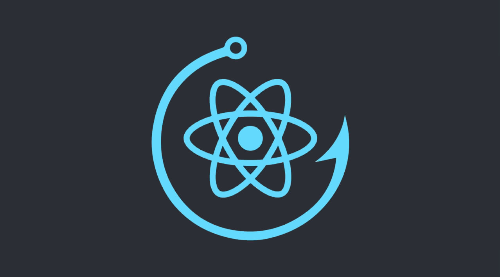

# Hooks Pattern



Uygulamanız içerisindeki bileşenlerde yeniden kullanılabilir bir `stateful logic` oluşturmak için fonksiyonları kullanın.

---

React, 16.8 versiyonu ile **[Hooks](https://reactjs.org/docs/hooks-intro.html)** adı verilen yeni bir özellik tanıttı. Hooks, ES2015 sınıf bileşenlerini (class components) kullanmak zorunda kalmadan React state ve yaşam döngüsü metodlarını (lifecycle methods) kullanmamıza imkan veriyor.

Hooks tam olarak bir tasarım deseni sayılmasa da, uygulama tasarımlarında çok önemli bir role sahiptir. Bir çok geleneksel tasarım deseni Hooks yapıları ile değiştirilebilir.

---

## Sınıf bileşenleri (Class components)

React Hooks tanıtılmadan önce, bileşenlere state ve lifecycle metodlarını ekleyebilmek için sınıf bileşenlerini kullanmamız gerekiyordu. React'teki tipik bir sınıf bileşeni şöyle görünebilir:

```js
class MyComponent extends React.Component {
  /* State ekleme ve özel metodları bağlama */
  constructor() {
    super()
    this.state = { ... }

    this.customMethodOne = this.customMethodOne.bind(this)
    this.customMethodTwo = this.customMethodTwo.bind(this)
  }

  /* Yaşam döngüsü metodları */
  componentDidMount() { ...}
  componentWillUnmount() { ... }

  /* Özel metotlar */
  customMethodOne() { ... }
  customMethodTwo() { ... }

  render() { return { ... }}
}

```

Bir sınıf bileşeni, constructor metodu içinde state, `componentDidMount` ve `componentWillUnmount` gibi yaşam döngüsü metodları ve ekstra mantık ekleyen özel metodlar barındırabilir.

React Hooks yayınlandıktan sonra sınıf bileşenlerini hala kullanabiliyor olsak da, bunu yapmanın bazı dezavantajları var. Sınıf bileşenlerini kullanırken karşılaşılan en yaygın sorunlara bakalım.

### ES2015 sınıflarını anlamak

Sınıf bileşenleri, state'i yönetmek ve yaşam döngüsü metodlarını kullanabileceğimiz tek bileşen olduğundan, ekstra işlevsellik eklemek amacıyla fonksiyonel bileşenleri sınıf bileşenlerine çevirmek durumunda kalabiliyorduk.

Bu örnekte, bir buton gibi davranan bir `div` elementimiz var.

```js
function Button() {
  return <div className='btn'>disabled</div>;
}
```

Ekranda her zaman `disabled` yazması yerine, kullanıcı butona tıkladığında `disabled` olan kısımı `enabled` olarak değiştirmek ve ekstra CSS stil kuralları tanımlamak istiyoruz.

Bunu yapabilmek için bileşen içerisinde `enabled` ve `disabled` durumunu tutan bir state
tanımlamamız gerekiyor. Yukarıdaki fonksiyonel bileşeni refaktör edip, butonun sahip olduğu state durumunu takip edebileceğimiz bir sınıf bileşenine çevirmemiz gerektiği anlamına geliyor.

```js
export default class Button extends React.Component {
  constructor() {
    super();
    this.state = { enabled: false };
  }

  render() {
    const { enabled } = this.state;
    const btnText = enabled ? "enabled" : "disabled";

    return (
      <div
        className={`btn enabled-${enabled}`}
        onClick={() => this.setState({ enabled: !enabled })}>
        {btnText}
      </div>
    );
  }
}
```

Sonunda butonumuz istediğimiz şekilde çalışıyor!

<iframe src="https://codesandbox.io/embed/hooks-1-2lp9w?fontsize=14&hidenavigation=1&theme=dark"
     style="width:100%; height:500px; border:0; border-radius: 4px; overflow:hidden;"
     title="hooks-1"
     allow="accelerometer; ambient-light-sensor; camera; encrypted-media; geolocation; gyroscope; hid; microphone; midi; payment; usb; vr; xr-spatial-tracking"
     sandbox="allow-forms allow-modals allow-popups allow-presentation allow-same-origin allow-scripts"
   ></iframe>

Bu örnekte kullandığımız bileşen küçük bir yapıya sahipti ve bu yüzden refaktör etmesi kolay oldu. Bununla birlikte, gerçek hayatta kullanacağımız bileşenler muhtemelen daha uzun kod satırlarına sahip bir yapıda olacaktır ve refaktör etmesi çok daha zor olacaktır.

Bileşenleri rekfatör ederken, yanlışlıkla herhangi bir davranışı değiştirmediğinizden emin olmanızın yanı sıra, **ES2015 sınıflarının nasıl çalıştığını anlamanız** gerekir. Neden özel metodları `bind` etmeliyiz? `constructor` tam olarak ne yapar? `this` kelimesi nereden geliyor? Veri akışını yanlışlıkla değiştirmeden bir bileşenin düzgün bir şekilde nasıl refaktör edileceğini bilmek zor olabilir.

### Yeniden yapılandırma (Restructuring)

Yazdığımız kodu bileşenler arasında paylaştırmanın yaygın yollarından bazıları [Higher Order Component](https://www.patterns.dev/posts/hoc-pattern/) ve [Render Props](https://www.patterns.dev/posts/render-props-pattern/) tasarım desenlerini kullanmaktır. Bu desenler geçerli ve doğru kullanım sunsalar da, uygulamanızda daha sonradan yeniden yapılandırma ihtiyacı doğurabilirler.

Uygulamanızı yeniden yapılandırmanın yanı sıra, daha derinde kalan bileşenler ile kodu paylaşmak amacıyla bileşenleri iç içe sarmalamak, **_kapsayıcı cehennemi_** (wrapper hell) olarak adlandırılan duruma yol açabilir.

```js
<WrapperOne>
  <WrapperTwo>
    <WrapperThree>
      <WrapperFour>
        <WrapperFive>
          <Component>
            <h1>Finally in the component!</h1>
          </Component>
        </WrapperFive>
      </WrapperFour>
    </WrapperThree>
  </WrapperTwo>
</WrapperOne>
```

**_Kapsayıcı cehennemi_**, uygulamadaki veri akışınının nasıl gerçekleştiğini anlamak açısından bazı zorluklar çıkarabilir, bu da uygulama içerisindeki beklenmedik davranışların neden gerçekleştiğini anlamayı zorlaştırabilir.

### Karmaşıklık

Sınıf bileşenlerine daha fazla mantık ekledikçe, bileşenin boyutu hızlıca artar. Eklediğimiz mantık karmakarışık ve yapılandırılmamış bir hal alabilir, bu da kodu okuyacak geliştiriciler için bileşen içerisinde gerçekleşen mantığı anlamayı zorlaştırabilir.

Yaşam döngüsü metodlarını kullanmak da kod içerisinde bir çok tekrar yapmaya sebep olabilir. `Counter` ve `Width` isimlerine sahip bileşenlerden oluşan şu örneği inceleyelim.

<iframe src="https://codesandbox.io/embed/hooks-2-bzhpw?fontsize=14&hidenavigation=1&theme=dark"
     style="width:100%; height:500px; border:0; border-radius: 4px; overflow:hidden;"
     title="hooks-2"
     allow="accelerometer; ambient-light-sensor; camera; encrypted-media; geolocation; gyroscope; hid; microphone; midi; payment; usb; vr; xr-spatial-tracking"
     sandbox="allow-forms allow-modals allow-popups allow-presentation allow-same-origin allow-scripts"
   ></iframe>

`App` bileşeninin yapısını şu şekilde görselleştirebiliriz:


Ufak bir bileşen olmasına rağmen, bileşenin içerdiği mantık sebebiyle şimdiden karışık bir yapıya sahip. Kodun bazı kısımları yalnızca `Counter` bileşenine ait bir mantık, geri kalanlar ise `width` bileşenine ait bir mantık için kullanılıyor. Bileşeniniz büyüdükçe, bileşeninizdeki mantığı yapılandırmak, bileşen içinde ilgili mantığı bulmak giderek zorlaşabilir.

Karışık mantığı bir kenara bırakırsak, yaşam döngüsü metodlarını kullanırken de aynı kod parçalarını tekrarlamak durumunda kalıyoruz. Örnekteki `componentDidMount` ve `componentWillUnmount` metodlarının ikisi de uygulamanın davranışını pencerenin **yeniden boyutlandırma** etkinliğine göre özelleştiriyor.

---

## Hooks

Sınıf bileşenlerinin React'ın sahip olduğu en iyi özelliklerden biri olmadığı aşikar. React, sınıf bileşenleri kullanan React geliştiricilerinin karşılaşabilecekleri ortak sorunları çözmek için, React Hooks'u tanıttı. **React Hooks**, bileşenlerin state durumunu yönetmek ve yaşam döngüsü metotlarını kullanabilmek için geliştirilmiş fonksiyonlardır. React Hooks bunları yapabilmemizi sağlar:

- Fonksiyonel bileşenlere state ekleme
- `componentDidMount` ve `componentWillUnmount` gibi yaşam döngüsü metotları kullanmadan bileşenlerin yaşam döngüsünü yönetme
- Uygulama içindeki birden çok bileşenin ulaşabileceği, yeniden kullanılabilir bir mantık oluşturma

İlk olarak, React Hooks fonksiyonlarını kullanarak fonksiyonel bir bileşene state nasıl eklenir görelim.

### useState Hook

React, fonksiyonel bileşenler içerisindeki state durumlarını yönetebilmek için `useState` adında bir fonksiyon sağlar.

Bir sınıf bileşeninin, `useState` hook'u kullanarak fonksiyonel bir bileşene nasıl yeniden yapılandırılabileceğini görelim.

```js
class Input extends React.Component {
  constructor() {
    super();
    this.state = { input: "" };

    this.handleInput = this.handleInput.bind(this);
  }

  handleInput(e) {
    this.setState({ input: e.target.value });
  }

  render() {
    <input onChange={handleInput} value={this.state.input} />;
  }
}
```

`useState` hook'unu kullanabilmek için, React'ın bize sağladığı `useState` metoduna erişmemiz gerekir. `useState` metodu, state'in başlangıç değeri olmak üzere bir argüman kabul eder (Bu örnekte boş bir string'e denk geliyor).

`useState` metodundan iki değeri [destructure](https://developer.mozilla.org/en-US/docs/Web/JavaScript/Reference/Operators/Destructuring_assignment) edebiliriz.

1. State'in **o an sahip olduğu değer**.
2. State'i **güncelleyebilmemize yarayan metot**.

```js
const [value, setValue] = React.useState(initialValue);
```

İlk değer, sınıf bileşenlerindeki `this.state.[value]` kısmı ile karşılaştırılabilir. İkinci değerse, yine sınıf bileşenlerinin sahip olduğu `this.setState` metodu ile karşılaştırılabilir.

Bir input kutusu ile çalıştığımız için, state durumunun o anki değerine `input`, state durumunu yöneteceğimiz metoda ise `setInput` adlarını verelim. Başlangıç değeri boş bir string değerine eşit olmalı.

```js
const [input, setInput] = React.useState("");
```

Şimdi `Input` sınıf bileşenini state mantığını yönetebileceğimiz bir fonksiyonel bileşene çevirebiliriz.

```js
function Input() {
  const [input, setInput] = React.useState("");

  return <input onChange={(e) => setInput(e.target.value)} value={input} />;
}
```

Aynı sınıf bileşenleri ile yaptığımız örnekteki gibi, `input` kutusunun sahip olduğu değer `input` state'i içerisinde tuttuğumuz değere tam olarak eşit. Kullanıcı input kutusuna herhangi bir şey yazdığında, `input` state'inde tutulan değer `setInput` metodu aracılığıyla güncellenecektir.

<iframe src="https://codesandbox.io/embed/hooks-3-oicu6?fontsize=14&hidenavigation=1&theme=dark"
     style="width:100%; height:500px; border:0; border-radius: 4px; overflow:hidden;"
     title="hooks-3"
     allow="accelerometer; ambient-light-sensor; camera; encrypted-media; geolocation; gyroscope; hid; microphone; midi; payment; usb; vr; xr-spatial-tracking"
     sandbox="allow-forms allow-modals allow-popups allow-presentation allow-same-origin allow-scripts"
   ></iframe>

---

### useEffect Hook

Fonksiyonel bir bileşende state durumunu yönetmek için `useState` hook'unu kullanabileceğimizi gördük fakat sınıf bileşenlerinin bir başka yararı da, yaşam döngüsü metodlarını kullanmaya imkan sunmalarıydı.

`useEffect` hook'u ile fonksiyonel bir bileşenin yaşam döngüsüne erişebiliriz. Bu hook, etkili bir biçimde `componentDidMount`, `componentDidUpdate` ve `componentWillUnmount` gibi yaşam döngüsü metodlarını birleştirir.

```js
componentDidMount() { ... }
useEffect(() => { ... }, [])

componentWillUnmount() { ... }
useEffect(() => { return () => { ... } }, [])

componentDidUpdate() { ... }
useEffect(() => { ... })
```

State Hook bölümünde kullandığımız input örneğinden devam edelim. Kullanıcı input kutusuna herhangi bir şey yazdığında, yazılan değeri aynı zamanda konsola da yazdırmak istiyoruz.

Bunu yapmak için, `input` değerini "dinleyen" bir `useEffect` hook'u kullanmamız gerekiyor. Bunu, `input`'u `useEffect` hook'u içerisindeki [**dependency array**](https://devtrium.com/posts/dependency-arrays)'e ekleyerek yapabiliriz. `dependency array`, `useEffect` hook'unun aldığı ikinci argümandır.

```js
useEffect(() => {
  console.log(`The user typed ${input}`);
}, [input]);
```

Kod ile deneyelim.

<iframe src="https://codesandbox.io/embed/hooks-4-p237n?fontsize=14&hidenavigation=1&theme=dark"
     style="width:100%; height:500px; border:0; border-radius: 4px; overflow:hidden;"
     title="hooks-4"
     allow="accelerometer; ambient-light-sensor; camera; encrypted-media; geolocation; gyroscope; hid; microphone; midi; payment; usb; vr; xr-spatial-tracking"
     sandbox="allow-forms allow-modals allow-popups allow-presentation allow-same-origin allow-scripts"
   ></iframe>

Kullanıcı input kutusuna herhangi bir şey yazdığında bu değer artık konsola da yazdırılacak.

### Custom Hooks

React'ın yerleşik olarak bize sunduğu (`useState`, `useEffect`, `useReducer`, `useRef`, `useContext`, `useMemo`, `useImperativeHandle`, `useLayoutEffect`, `useDebugValue`, `useCallback`) gibi bazı hook'lar haricinde, kolay bir şekilde kendi özel hook'larımızı oluşturabiliriz.

Bütün hook'ların `use` ile başladığınız fark etmiş olabilirsiniz. React'ın yazdığınız hook fonksiyonunun [**Hook kuralları**](https://reactjs.org/docs/hooks-rules.html)nı ihlal edip etmediğini kontrol edebilmesi için, bu yazım kuralına uymak önemlidir.

Diyelim ki, kullanıcının input kutusuna yazabileceği belli karakterleri (tuşları) takip etmek istiyoruz. Yazacağımız hook'un, takip etmek istediğimiz karakteri argüman olarak alması gerekir.

```js
function useKeyPress(targetKey) {}
```

Argüman olarak geçilen karaktere `keydown` ve `keyup` [**event listener**](https://www.w3schools.com/js/js_htmldom_eventlistener.asp) fonksiyonlarını eklemek istiyoruz. Eğer kullanıcı o karaktere ait olan tuşa basarsa, yani `keydown` olayı tetiklenirse ilgili hook'un state durumu `true` olmalıdır. Aksi taktirde, kullanıcı tuşa basmayı bıraktığında `keyup` olayı tetiklenmeli ve state durumu `false` olmalıdır.

```js
function useKeyPress(targetKey) {
  const [keyPressed, setKeyPressed] = React.useState(false);

  function handleDown({ key }) {
    if (key === targetKey) {
      setKeyPressed(true);
    }
  }

  function handleUp({ key }) {
    if (key === targetKey) {
      setKeyPressed(false);
    }
  }

  React.useEffect(() => {
    window.addEventListener("keydown", handleDown);
    window.addEventListener("keyup", handleUp);

    return () => {
      window.removeEventListener("keydown", handleDown);
      window.removeEventListener("keyup", handleUp);
    };
  }, []);

  return keyPressed;
}
```

Harika! Artık bu özel hook'u input uygulamamızda kullanabiliriz. Kullanıcı `q`, `l` veya `w` tuşlarından birine bastığında bunu konsola yazdıralım.

<iframe src="https://codesandbox.io/embed/hooks-5-xplez?fontsize=14&hidenavigation=1&theme=dark"
     style="width:100%; height:500px; border:0; border-radius: 4px; overflow:hidden;"
     title="hooks-5"
     allow="accelerometer; ambient-light-sensor; camera; encrypted-media; geolocation; gyroscope; hid; microphone; midi; payment; usb; vr; xr-spatial-tracking"
     sandbox="allow-forms allow-modals allow-popups allow-presentation allow-same-origin allow-scripts"
   ></iframe>

Oluşturduğumuz mantığı `Input` bileşeni içerisinde yazmak yerine, `useKeyPress` hook'u içerisinde kullandık ve artık aynı mantığı kod tekrarı yapmadan farklı bileşenler ile kullanabiliriz.

Hook'ların bir başka büyük avantajı, topluluk tarafından inşa ediliip paylaşılabilmesidir. `useKeyPress` hook'unu kendimiz yazdık lakin aslında bu pek de gerekli değildi. Bu ve buna benzer bir çok [hook](https://github.com/streamich/react-use/blob/master/docs/useKeyPress.md) zaten önceden başkası tarafından geliştirildi ve kullanıma hazır olarak bizi bekliyor.

Topluluk tarafından yaratılmış ve kullanıma hazır olan bazı hook'ları bu web sayfalarından inceleyebilirsiniz.

- [React Use](https://github.com/streamich/react-use)
- [useHooks](https://usehooks.com/)
- [Collection of React Hooks](https://nikgraf.github.io/react-hooks/)

---

Şimdi önceki bölümde incelediğimiz counter ve width örneğini tekrardan yazalım. Bu sefer sınıf bileşenleri yerine React Hook'larını kullanacağız.

<iframe src="https://codesandbox.io/embed/hooks-6-2w0ll?fontsize=14&hidenavigation=1&theme=dark"
     style="width:100%; height:500px; border:0; border-radius: 4px; overflow:hidden;"
     title="hooks-6"
     allow="accelerometer; ambient-light-sensor; camera; encrypted-media; geolocation; gyroscope; hid; microphone; midi; payment; usb; vr; xr-spatial-tracking"
     sandbox="allow-forms allow-modals allow-popups allow-presentation allow-same-origin allow-scripts"
   ></iframe>

`App` fonksiyonu içerisindeki mantığı birkaç farklı parçaya ayırdık.

- `useCounter`: `count`'un o anki değerini geri döndüren özel bir hook, `count`'u arttıran ve azaltan birer metot.
- `useWindowWidth`: Tarayıcının o anki genişliğini geri döndüren özel bir hook.
- `App`: `Counter` ve `Width` bileşenlerini geri döndüren fonksiyonel ve durumsal bir bileşen.

Sınıf bileşenleri yerine React Hooks kullanarak, uygulamadaki mantığı daha ufak ve yeniden kullanılabilir parçalara ayırabiliriz.

Eski `App` sınıf bileşenine kıyasla yaptığımız değişiklikleri görselleştirelim.


React Hook'ları kullanmak, bileşenlerdeki **mantığı ayrıştırmayı** kolaylaştırır ve bileşeni ufak parçalara bölmeyi mümkün kılar. Aynı state mantığını _tekrar kullanabilmeyi_ kolaylaştırır. ES2015 sınıfları hakkında ustalaşmak artık gerekli değildir ve yeniden kullanılabilir state mantığa sahip olmak, bileşenlerin test edilebilirliğini, esnekliğini ve okunabilirliğini arttırır.

### Ek Hook'lar Kılavuzu

#### Hook'ları eklemek

Diğer bileşenler gibi, Hook'ları da yazdığınız koda eklemek istediğinizde kullanılan özel fonksiyonlar vardır. Bu fonksiyonlardan arasından sık kullanılanlara göz atalım:

1- **useState**:

`useState`, geliştiricilerin sınıf bileşenlerine ihtiyaç duymadan, fonksiyonel bileşenler içerisinde güncellenebilir ve manipüle edilebilir bir state mantığı oluşturmanalarını sağlar. Bu hook'un bir avantajı da sade olması ve diğer React Hook'ları kadar karmaşık bir yapıya sahip olmamasıdır.

2- **useEffect**:

`useEffect`, yaşam döngüsü olayları gerçekleştiği sırada, yazılan kodları çalıştırmak için kullanılır. Fonksiyonun ana gövdesi mutasyonlara (mutations), aboneliklere (subscriptions), zamanlayıcılara (timers), loglamalara (logging) ve herhangi bir başka side effect gerçekleşmesine izin vermez. Eğer bunlara izin verirse, kullanıcı arayüzünde kafa karıştırıcı hatalara ve tutarsızlıklara yol açabilir.

3- **useContext**:

`useContext`, `React.createcontext` tarafından döndürülen değer olan "context" objesini kabul eder ve o context kapsamında geçerli olan değerleri geri döndürür. Bu hook, React Context API ile birlikte çalışır ve [prop drilling](https://kentcdodds.com/blog/prop-drilling) yapmaya gerek kalmadan uygulama boyunca prop'ları paylaşmaya yarar.

`useContext` fonksiyonuna gönderilen argüman her zaman context objesi olmalıdır ve eğer context değeri değişirse, `useContext` tarafından çağırılan bütün bileşenler yeniden render olurlar.

4- **useRecuder**:

`useReducer`, `setState`'in bir alternatifidir ve özellikle birden fazla alt değer içeren karmaşık yapılar veya sonraki state durumunun bir öncekine bağlı olduğu durumlarda tercih edilir. Parametre olarak `reducer` fonksiyonu ve bir başlangıç değeri alır ve güncel state durumunu ve `dispatch` fonksiyonunu tutan bir dize geri döndürür. `useReducer` ayrıca derin güncellemeleri tetikleyen bileşenlerin performansını optimize eder.

##### Hook'ları kullanmanın artı ve eksileri

Hook'ları kullanmanın bazı faydaları:

**Daha kısa kod blokları**: Hook'lar, kodunuzu anlamsal ve fonksiyonel olarak gruplayabilmenizi sağlar. Bu da kodu sadece temiz ve öz değil, aynı zamanda daha kısa yapar. Aşağıda, React kullanarak aranabilir bir ürün veri tablosunun hem sınıf, hem de fonksiyonel bir bileşenle yazılmış bir örneğini görüyoruz.

##### Stateful bileşenler

```js
class TweetSearchResults extends React.Component {
  constructor(props) {
    super(props);
    this.state = {
      filterText: "",
      inThisLocation: false,
    };

    this.handleFilterTextChange = this.handleFilterTextChange.bind(this);
    this.handleInThisLocationChange = this.handleInThisLocationChange.bind(
      this
    );
  }

  handleFilterTextChange(filterText) {
    this.setState({
      filterText: filterText,
    });
  }

  handleInThisLocationChange(inThisLocation) {
    this.setState({
      inThisLocation: inThisLocation,
    });
  }

  render() {
    return (
      <div>
        <SearchBar
          filterText={this.state.filterText}
          inThisLocation={this.state.inThisLocation}
          onFilterTextChange={this.handleFilterTextChange}
          onInThisLocationChange={this.handleInThisLocationChange}
        />
        <TweetList
          tweets={this.props.tweets}
          filterText={this.state.filterText}
          inThisLocation={this.state.inThisLocation}
        />
      </div>
    );
  }
}
```

##### Aynı bileşen Hook ile yazıldığında

```js
const TweetSearchResults = ({ tweets }) => {
  const [filterText, setFilterText] = useState("");
  const [inThisLocation, setInThisLocation] = useState(false);
  return (
    <div>
      <SearchBar
        filterText={filterText}
        inThisLocation={inThisLocation}
        setFilterText={setFilterText}
        setInThisLocation={setInThisLocation}
      />
      <TweetList
        tweets={tweets}
        filterText={filterText}
        inThisLocation={inThisLocation}
      />
    </div>
  );
};
```

##### Karışık bileşen yapılarını basitleştirir

JavaScript sınıfları yönetilmesi, [**hot reload**](https://webpack.js.org/concepts/hot-module-replacement/) ile kullanılması ve kod küçültme (minify) gibi konularda zorluk çıkarabilir. React Hookları fonksiyonel programlama paradigmasını kullanarak bu problemleri çözer. Hookları kullandığımız sürece artık sınıf bileşenlerine ihtiyacımız yok.

##### Tekrardan kullanılabilir mantık

JavaScript sınıfları, çoklu inheritance seviyeleri sebebiyle bir anda çok hızlı karmaşıklaşıp, uygulamada potansiyel hata durumları oluşturabilir. Hookları kullanarak `state` ve diğer React özelliklerini, sınıf bileşenlerine ihtiyaç duymadan kullanabilirsiniz. React ile, kod tekrarı yapmaya gerek kalmadan tekrar kullanılabilir `state` mantıkları oluşturabilirsiniz. Bu hata şansını azaltır ve yalnızca fonksiyonlar kullanarak bir yapı kurmanıza izin verir.

##### `non-visual logic` paylaşımı

Hooklar ortaya çıkana kadar, React'ın görsel olmayan mantığı çıkarma ve paylaşma imkanı yoktu. Bu sebeple zamanla bu sorunu çözmek adına HOC ve Render Props gibi farklı kompleks yapılar kurulmaya başlandı. Hooklar ile gelen fonksiyonlar arası durumsal mantık (stateful logic) paylaşımı bu problemleri çözdü.

Yine de Hookların kullanımının göz ardı edilmemesi gereken bazı potansiyel dezavantajları da vardır:

- Yazım kurallarına dikkat etmek gerekir. Bir [linter](https://www.testim.io/blog/what-is-a-linter-heres-a-definition-and-quick-start-guide/) kullanmadan hangi kuralı ihlal ettiğinizi bilmeniz zor olabilir.
- Doğru şekilde kullanmayı öğrenebilmek için hatırı sayılır zamana ihtiyaç duyulabilir (Örn: useEffect).
- Yanlış kullanımlara dikkat edin (Örn: useCallback, useMemo).

#### React Hooks vs Classes

Hooklar tanıdıldığında bu yeni bir problem yarattı: fonksiyonel ya da sınıf bileşenleri yapılarından hangisini, ne zaman kullanacağımızı nasıl bileceğiz? Hooklar yardımıyla, fonksiyonel bileşenlerde bile state ve yaşam döngüsü metodlarını kullanmak mümkün oldu. Bir sınıf yazmaya gerek kalmadan Hooklar ile yerel bazda state tutabilir ve diğer React özelliklerini kullanabiliriz.

Seçim yapma konusunda yardımcı olması adına, Hooklar ve sınıf bileşenleri arasındaki bazı farklar:

| React Hooks                                                                         | Classes                                                                                                                                                                  |
| ----------------------------------------------------------------------------------- | ------------------------------------------------------------------------------------------------------------------------------------------------------------------------ |
| Birden fazla hiyerarşi sahip yapıları önmeleye ve kodu temiz tutmaya yardımcı olur. | Eğer Devtools ortamında uygulamanızı görmek istiyorsanız ve HOC veya RenderProps kullanıyorsanız uygulamanızı birden fazla hiyerarşiyle yeniden yapılandırmanız gerekir. |  |  |  |
| React bileşenleri arasında homojenlik sağlar.                                       | Sınıflar, `binding` ve `context` gibi bağlamlar nedeniyle hem insanların hem de makinelerin aklını karıştırır..                                                          |
