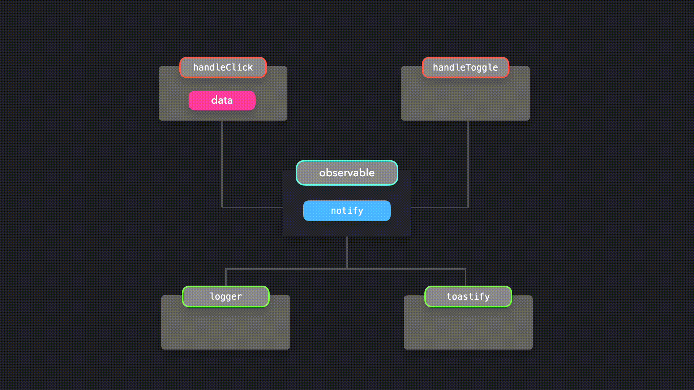

# Observer Pattern

---

Bu yazı [patterns.dev](https://www.patterns.dev/posts/observer-pattern/)'den çevirilmiştir.

---

_Observables'ı bir olay meydana geldiğinde, subscriber'ları bilgilendirmek için kullanın._


**Observer Pattern** ile belirli objeleri yani **observer**'ları, **observable** olarak adlandırılan başka bir nesneye abone edebiliriz. Ne zaman bir olay meydana gelse, observable nesnesi tüm observer'ları bilgilendirir.

---

Observable nesne genellikle 3 önemli parça içerir:

- `observers :` bir olay meydana geldiğinde, bilgilendirilecek olan observers dizisi

- `subscribe() :` observers listesine, observers eklemek için kullanılan metod

- `unsubscribe() :` observers listesinden, observers çıkarmak için kullanılan metod

- `notify() :` bir olay meydana geldiğinde, bütün observer'ları bilgilendirmek için kullanılan metod

---

Mükemmel, hadi bir tane observable oluşturalım! Bunu yapmanın kolay yolu **ES6 sınıfını** kullanmaktır.

```js
class Observable {
  constructor() {
    this.observers = [];
  }

  subscribe(func) {
    this.observers.push(func);
  }

  unsubscribe(func) {
    this.observers = this.observers.filter((observer) => observer !== func);
  }

  notify(data) {
    this.observers.forEach((observer) => observer(data));
  }
}
```

Mükemmel! Artık subscribe metodu ile observers listesine observer ekleyebilir, unsubscribe metodu ile observers çıkarabilir ve notify metodu ile tüm subscriber'ları bilgilendirebiliriz.

Observable ile bir şeyler inşa edelim. Yalnızca iki bileşenden oluşan çok basit bir uygulamamız var: bir tane `button` ve bir tane `switch`.

```js
export default function App() {
  return (
    <div className='App'>
      <Button>Click me!</Button>
      <FormControlLabel control={<Switch />} />
    </div>
  );
}
```

Uygulama ile **kullanıcı etkileşimini** takip etmek istiyoruz. Bir kullanıcı button'a tıkladığında veya switch'i değiştirdiğinde, bu olayı timestamp'i ile birlikte kaydetmek istiyoruz. Kaydetmenin yanı sıra, bir olay meydana geldiğinde toast bildirimi oluşturmak istiyoruz.

Esasen, yapmak istediğimiz şey şudur:



Kullanıcı `handleClick` veya `handleToggle` fonksiyonunu çağırdığında, bu fonksiyonlar observer'daki `notify` fonksiyonunu çağırır. `Notify` metodu, tüm subscriber'lara `handleClick` veya `handleToggle` fonksiyonları tarafından iletilen verileri bildirir!

İlk olarak, `logger` ve `toastify` fonksiyonlarını oluşturalım. Bu fonksiyonlar sonunda `notify` metodundan `data` alacaktır.

```js
import { ToastContainer, toast } from 'react-toastify';

function logger(data) {
  console.log(`${Date.now()} ${data}`);
}

function toastify(data) {
  toast(data);
}

export default function App() {
  return (
    <div className='App'>
      <Button>Click me!</Button>
      <FormControlLabel control={<Switch />} />
      <ToastContainer />
    </div>
  );
}
```

Şu anda, `logger` ve `toastify` fonksiyonları observable'nin farkında değil: bu observable henüz onları bilgilendiremez! Onları observer yapmak için, observable üzerindeki `subscribe` metodunu kullanarak onlara subscribe olmamız gerekirdi!

```js
import { ToastContainer, toast } from 'react-toastify';

function logger(data) {
  console.log(`${Date.now()} ${data}`);
}

function toastify(data) {
  toast(data);
}

observable.subscribe(logger);
observable.subscribe(toastify);

export default function App() {
  return (
    <div className='App'>
      <Button>Click me!</Button>
      <FormControlLabel control={<Switch />} />
      <ToastContainer />
    </div>
  );
}
```

Bir olay meydana geldiğinde, `logger` ve `toastify` fonksiyonları bilgilendirilecektir. Şimdi sadece aslında observable olanı bilgilendiren
fonksiyonları uygulamamız gerekiyor: `handleClick` ve `handleToggle` fonksiyonları! Bu fonksiyonlar, observable üzerinde `notify` metodunu çağırmalı ve observer'ların alması gereken dataları iletmelidir.

```js
import { ToastContainer, toast } from 'react-toastify';

function logger(data) {
  console.log(`${Date.now()} ${data}`);
}

function toastify(data) {
  toast(data);
}

observable.subscribe(logger);
observable.subscribe(toastify);

export default function App() {
  function handleClick() {
    observable.notify('User clicked button!');
  }

  function handleToggle() {
    observable.notify('User toggled switch!');
  }

  return (
    <div className='App'>
      <Button>Click me!</Button>
      <FormControlLabel control={<Switch />} />
      <ToastContainer />
    </div>
  );
}
```

Mükemmel! Tüm akışı yeni bitirdik: `handleClick` ve `handleToggle`, datalarla birlikte observer'da notify metodunu çağırır, ardından observer subscriber'ları bilgilendirir: Bu durumda `logger` ve `toastify` fonksiyonlarını.

Bir kullanıcı component'lardan herhangi biriyle etkileşime girdiğinde, hem `logger` hem de `toastify` fonksiyonları, `notify` metoduna aktardığımız data'larla bilgilendirilecektir!

---

Bu kısımdaki kodlara [codesandbox](https://codesandbox.io/s/observer-pattern-1-md8k5?from-embed) üzerinden erişebilirsiniz.

---

Observer Pattern'ini birçok şekilde kullanabilmemize rağmen, **asynchronous, event-based data** ile çalışırken çok faydalı olabilir. Belirli data'ların indirilmesi bittiğinde belirli component'lerin bilgilendirilmesini veya kullanıcılar bir mesaj panosuna yeni mesajlar gönderdiğinde; diğer tüm üyeleri bilgilendirilmesini isteyebilirsiniz.

---

## Örnek Kullanım

Observer Pattern'i kullanan popüler bir kitaplık örneği RxJS'dir.

---

_ReactiveX, olay dizilerini yönetmek için ideal bir yol ihtiyacını karşılamak için Observer Pattern'ini, Iterator Pattern'i ve Functional Programming'i koleksiyonlarla birleştirir. - RxJS_

---

RxJS ile observables oluşturabilir ve belirli olaylara subscribe edebiliriz!
Bir kullanıcının belgeyi sürükleyip sürüklemediğini beleglerinde kaydeden bir örneğe bakalım.

---

Bu kısımdaki kodlara [codesandbox](https://codesandbox.io/embed/stoic-turing-kqq9z) üzerinden erişebilirsiniz.

---

RxJS, Observable Pattern ile çalışan tonlarca built-in features ve örneğe sahiptir.

---

## Artıları

Observer Pattern'i kullanmak, **separation of concerns**'i ve single-responsiblity principle'yi uygulamanın harika bir yoludur. Observer nesneler, observable nesneye sıkı bir şekilde bağlı değildir ve herhangi bir zamanda ayrıştırılabilir ya da birleştirilebilirler. Observable nesne, olayları izlemekten sorumluyken, observers alınan data'ları yalnızca idare eder.

---

## Eksileri

Bir observer çok karmaşık hale gelirse, tüm subscribers'ı bilgilendirirken performans sorunlarına neden olabilir.

---

### Kaynaklar

- [RxJS](https://rxjs-dev.firebaseapp.com/)
- [JavaScript Design Patterns: The Observer Pattern](https://www.sitepoint.com/javascript-design-patterns-observer-pattern/)
- [Observer](https://refactoring.guru/design-patterns/observer)
