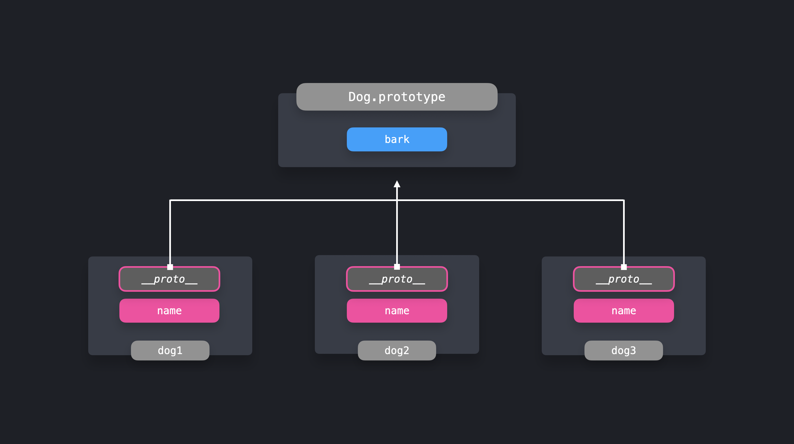
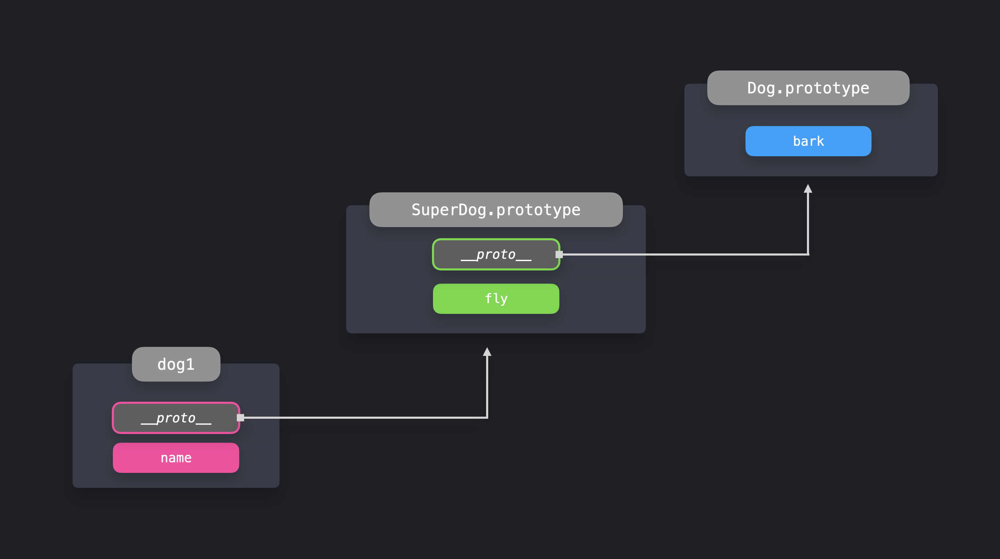

## Prototype Pattern

---

Bu yazı [patterns.dev](https://www.patterns.dev/posts/prototype-pattern/)'den çevirilmiştir.

---

*Aynı türden birçok nesne arasında özellikleri paylaşın.*

Prototype pattern, aynı türden birçok nesne arasında özellikleri paylaşmanın kullanışlı bir yoludur. Prototype, JavaScript'e özgü bir nesnedir ve Prototype zinciri aracılığıyla nesneler tarafından erişilebilir.

Uygulamalarımızda genellikle aynı türden birçok nesne oluşturmamız gerekir. Bunu yapmanın kullanışlı bir yolu, bir ES6 sınıfının birden çok örneğini oluşturmaktır.

Diyelim ki birçok köpek yaratmak istiyoruz! Örneğimizde, köpekler o kadarını yapamazlar: sadece bir isimleri vardır ve havlayabilirler!

```js
class Dog {
  constructor(name) {
    this.name = name;
  }

  bark() {
    return `Woof!`;
  }
}

const dog1 = new Dog("Daisy");
const dog2 = new Dog("Max");
const dog3 = new Dog("Spot");
```

Burada, `constructor` nasıl bir `name` özelliği içerdiğine ve sınıfın kendisinin bir `bark` özelliği içerdiğine dikkat edin. ES6 sınıflarını kullanırken, sınıfın kendisinde tanımlanan tüm özellikler, bu durumda `bark`, `prototype`'a otomatik olarak eklenir.

`Prototype`, bir constructor üzerinde `prototype` özelliğine erişerek veya herhangi bir *instance*'da `__proto__` özelliği aracılığıyla doğrudan görebiliriz.

```js
console.log(Dog.prototype);
// constructor: ƒ Dog(name, breed) bark: ƒ bark()

console.log(dog1.__proto__);
// constructor: ƒ Dog(name, breed) bark: ƒ bark()
```

Constructor'ın herhangi bir instance'daki `__proto__` değeri, constructor'ın prototype'ına doğrudan bir referanstır! Doğrudan nesnede olmayan bir nesne üzerindeki bir özelliğe erişmeye çalıştığımızda, JavaScript, özelliğin prototype zincirinde mevcut olup olmadığını görmek için *prototype zincirinde aşağı iner*.



Prototype pattern, aynı özelliklere erişimi olması gereken nesnelerle çalışırken çok güçlüdür. Her seferinde özelliğin bir kopyasını oluşturmak yerine, tüm örneklerin prototip nesnesine erişimi olduğundan, özelliği prototype'a kolayca ekleyebiliriz.

Tüm instances'ların prototype'a erişimi olduğundan, instances'ları oluşturduktan sonra bile prototype özellikler eklemek kolaydır.

Köpeklerimizin sadece havlayabilmeleri değil, aynı zamanda oynayabilmeleri gerektiğini de söyleyin! Prototype'a bir play özelliği ekleyerek bunu mümkün kılabiliriz.

```js
class Dog {
  constructor(name) {
    this.name = name;
  }

  bark() {
    return `Woof!`;
  }
}

const dog1 = new Dog("Daisy");
const dog2 = new Dog("Max");
const dog3 = new Dog("Spot");

Dog.prototype.play = () => console.log("Playing now!");

dog1.play();	
```

```console
Playing now! 
```

`Prototype chain` terimi, birden fazla adım olabileceğini gösterir. Aslında! Şimdiye kadar, yalnızca `__proto__`'nin referans aldığı ilk nesnede doğrudan kullanılabilen özelliklere nasıl erişebileceğimizi gördük. Ancak, prototype'ların kendilerinin de bir `__proto__` nesnesi vardır!

Başka bir köpek türü yaratalım, süper bir köpek! Bu köpek, normal bir `Dog` her şeyi miras almalı, ancak aynı zamanda uçabilmelidir. `Dog` sınıfını genişletip bir `fly` yöntemi ekleyerek süper bir köpek oluşturabiliriz.

```js
class SuperDog extends Dog {
  constructor(name) {
    super(name);
  }

  fly() {
    return "Flying!";
  }
}
```

`Daisy` adında uçan bir köpek yaratalım ve onun havlamasına ve uçmasına izin verelim!

```js
class Dog {
  constructor(name) {
    this.name = name;
  }

  bark() {
    console.log("Woof!");
  }
}

class SuperDog extends Dog {
  constructor(name) {
    super(name);
  }

  fly() {
    console.log(`Flying!`);
  }
}

const dog1 = new SuperDog("Daisy");
dog1.bark();
dog1.fly();
```

```console
Woof! 
Flying! 
```

`Dog` sınıfını genişlettiğimiz (extend) için `bark` methoduna erişimimiz var. `SuperDog` prototipindeki `__proto__` değeri, `Dog.prototype` nesnesine işaret eder!



Buna neden prototype *zinciri* (*chain*) denildiği açıklığa kavuşuyor: nesnede doğrudan mevcut olmayan bir özelliğe erişmeye çalıştığımızda, JavaScript, özelliği bulana kadar `__proto__`'nin işaret ettiği tüm nesneleri özyinelemeli olarak aşağı iner!

## Object.create

`Object.create` methodu, prototipinin değerini açıkça iletebileceğimiz yeni bir nesne oluşturmamızı sağlar.

```js	
const dog = {
  bark() {
    return `Woof!`;
  }
};

const pet1 = Object.create(dog);
```

`Pet1`'in kendisinin herhangi bir özelliği olmamasına rağmen, prototip zincirindeki(prototype chain) özelliklere erişimi vardır! `Pet1`'in prototipi olarak `dog` nesnesini geçtiğimiz için `bark` özelliğine erişebiliriz.

```js
const dog = {
  bark() {
    console.log(`Woof!`);
  }
};

const pet1 = Object.create(dog);

pet1.bark(); // Woof!
console.log("Direct properties on pet1: ", Object.keys(pet1));
console.log("Properties on pet1's prototype: ", Object.keys(pet1.__proto__));
```

```console
Woof!
Direct properties on pet1:  []
Properties on pet1's prototype:  ['bark']
```

Mükemmel! `Object.create`, yeni oluşturulan nesnenin prototipini belirterek, nesnelerin diğer nesnelerden doğrudan özellikleri devralmasına izin vermenin basit bir yoludur. Yeni nesne, prototip zincirinde yürüyerek yeni özelliklere erişebilir.

---

Prototype pattern, nesnelerin diğer nesnelerden özelliklere erişmesine ve özellikleri devralmasına kolayca izin vermemizi sağlar. Prototype chain, nesnenin kendisinde doğrudan tanımlanmayan özelliklere erişmemize izin verdiğinden, yöntemlerin ve özelliklerin tekrarlanmasını önleyebilir, böylece kullanılan bellek miktarını azaltabiliriz.

---

### Kaynaklar

* [Object.create - MDN](https://developer.mozilla.org/en-US/docs/Web/JavaScript/Reference/Global_Objects/Object/create)
* [Prototype - ECMA](https://262.ecma-international.org/5.1/#sec-4.3.5)