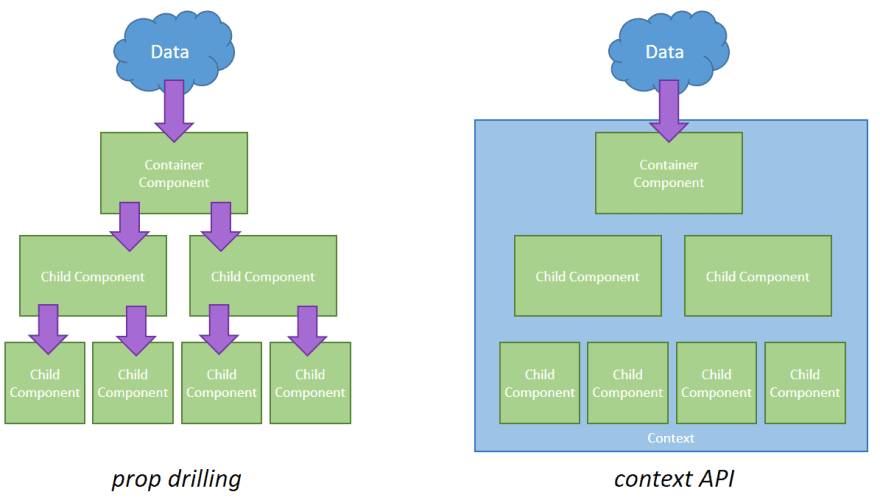
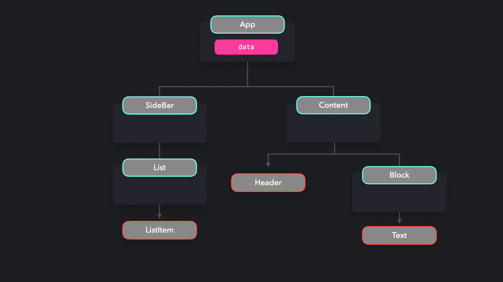
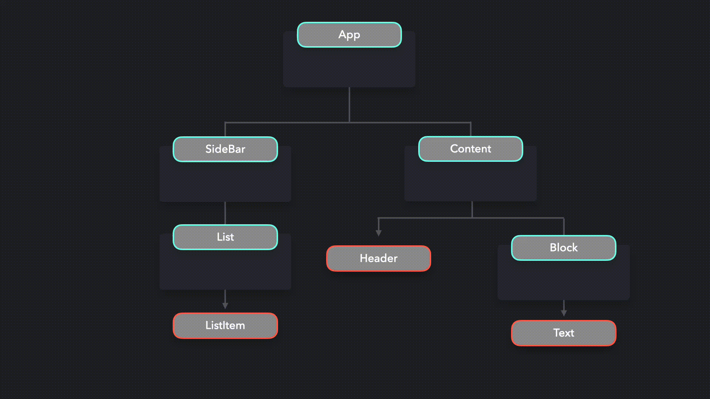

## Provider Pattern

---

Bu yazı [patterns.dev](https://www.patterns.dev/posts/provider-pattern/)'den çevirilmiştir.

---

*Verileri birden çok alt bileşen (component) için kullanılabilir hale getirin.*



Bazı durumlarda, bir uygulamadaki birçok (tümü olmasa da) componente veri sağlamak istiyoruz. `props` kullanarak componentlere veri aktarabilsek de, uygulamanızdaki hemen hemen tüm componentlerin propların değerine erişmesi gerekiyorsa bunu yapmak zor olabilir.

Çoğu zaman, *prop drilling* adı verilen bir şeyle karşılaşırız; bu, component ağacının çok aşağılarına props geçtiğimizde görülen durumdur. Props öğelerine dayanan kodu yeniden düzenlemek neredeyse imkansız hale gelir ve belirli verilerin nereden geldiğini bilmek zordur.

Diyelim ki belirli verileri içeren bir `App` componentimiz var. Component ağacının çok aşağısında, tümü bu verilere ihtiyaç duyan bir `ListItem`, `Header` ve `Text` componentimiz var. Bu verileri bu componentlere aktarmak için, birden çok component katmanından geçirmemiz gerekir.



Kod tabanımızda bu, aşağıdaki gibi görünecektir:

```js
function App() {
  const data = { ... }
  return (
    <div>
      <SideBar data={data} />
      <Content data={data} />
    </div>
  )
}
const SideBar = ({ data }) => <List data={data} />
const List = ({ data }) => <ListItem data={data} />
const ListItem = ({ data }) => <span>{data.listItem}</span>
const Content = ({ data }) => (
  <div>
    <Header data={data} />
    <Block data={data} />
  </div>
)
const Header = ({ data }) => <div>{data.title}</div>
const Block = ({ data }) => <Text data={data} />
const Text = ({ data }) => <h1>{data.text}</h1>
```

Propları bu şekilde aktarmak oldukça dağınık olabilir. Gelecekte `data` prop’u yeniden adlandırmak istersek, onu tüm componentlerde yeniden adlandırmamız gerekir. Uygulamanız ne kadar büyük olursa, *prop drilling* o kadar zor olabilir.

Bu verileri kullanması gerekmeyen tüm component katmanlarını atlayabilseydik optimal olurdu. `data` değerine erişmesi gereken componentlere, prop drillinge (prop sondajı) dayanmadan doğrudan erişim sağlayan bir şeye ihtiyacımız var.

**Provider Pattern’in (Sağlayıcı Kalıbı)** bize yardımcı olabileceği yer burasıdır! Provider Pattern ile verileri birden çok component için kullanılabilir hale getirebiliriz. Bu verileri her katmandan proplar aracılığıyla geçirmek yerine, tüm componentleri bir Providera sarabiliriz. `Provider`, `Context` nesnesi tarafından bize sağlanan daha yüksek dereceli bir componenttir. React’in bize sağladığı `createContext` metodunu kullanarak bir Context nesnesi oluşturabiliriz.

Provider, aktarmak istediğimiz verileri içeren bir `value` propu alır. Bu provider ile sarmallanmış *tüm* componentlerin, `value` prop değerine erişimi vardır.

```js
const DataContext = React.createContext()
function App() {
  const data = { ... }
  return (
    <div>
      <DataContext.Provider value={data}>
        <SideBar />
        <Content />
      </DataContext.Provider>
    </div>
  )
}
```

Artık data propu her bir componente manuel olarak aktarmamız gerekmiyor! Peki `ListItem`, `Header` ve `Text` componenti `data` değerine nasıl erişebilir?

Her component, `useContext` kancasını (hook) kullanarak `data` değerine erişebilir. Bu hook, verilerin bu durumda `DataContext` ile referans aldığı bağlamı alır. `useContext` hooku, bağlam nesnesine veri okumamızı ve yazmamızı sağlar.

```js
const DataContext = React.createContext();
function App() {
  const data = { ... }
  return (
    <div>
      <SideBar />
      <Content />
    </div>
  )
}
const SideBar = () => <List />
const List = () => <ListItem />
const Content = () => <div><Header /><Block /></div>
function ListItem() {
  const { data } = React.useContext(DataContext);
  return <span>{data.listItem}</span>;
}
function Text() {
  const { data } = React.useContext(DataContext);
  return <h1>{data.text}</h1>;
}
function Header() {
  const { data } = React.useContext(DataContext);
  return <div>{data.title}</div>;
}
```

`data` değerini kullanmayan componentlerin hiçbir şekilde `data` değeri ile uğraşması gerekmeyecektir. Artık props öğelerinin değerine ihtiyaç duymayan componentler aracılığıyla props öğelerini birkaç seviye aşağı aktarma konusunda endişelenmemize gerek yok, bu da yeniden düzenlemeyi çok daha kolay hale getiriyor.



Provider Pattern’i, global verileri paylaşmak için çok kullanışlıdır. Provider pattern için yaygın bir kullanım örneği, birçok componente bir tema UI state’ini paylaşmaktır.

Bir liste gösteren basit bir uygulamamız olduğunu varsayalım.

---

Bu kısımdaki kodlara [codesandbox](https://codesandbox.io/embed/busy-oskar-ifz3w) üzerinden erişebilirsiniz.

---

Kullanıcının, light mod ve dark mod arasında geçiş yapabilmesini istiyoruz. Kullanıcı dark moddan light moda geçtiğinde ve tam tersi olduğunda, arka plan rengi ve metin rengi değişmelidir! Mevcut tema değerini her bir componente aktarmak yerine, componentleri bir `ThemeProvider` ilesarabilir ve mevcut tema renklerini provider’a iletebiliriz.

```js
export const ThemeContext = React.createContext();
const themes = {
  light: {
    background: "#fff",
    color: "#000"
  },
  dark: {
    background: "#171717",
    color: "#fff"
  }
};
export default function App() {
  const [theme, setTheme] = useState("dark");
  function toggleTheme() {
    setTheme(theme === "light" ? "dark" : "light");
  }
  const providerValue = {
    theme: themes[theme],
    toggleTheme
  };
  return (
    <div className={`App theme-${theme}`}>
      <ThemeContext.Provider value={providerValue}>
        <Toggle />
        <List />
      </ThemeContext.Provider>
    </div>
  );
}
```

`Toggle` ve `List` componentlerinin her ikisi de `ThemeContext` providerı ile sarmallandığından , providera bir `value` olarak iletilen `theme` değerine ve `toggleTheme`'e erişebiliyoruz.

`Toggle` componenti içinde, temayı uygun şekilde güncellemek için `toggleTheme` fonksiyonunu kullanabiliriz.

```js
import React, { useContext } from "react";
import { ThemeContext } from "./App";

export default function Toggle() {
  const theme = useContext(ThemeContext);

  return (
    <label className="switch">
      <input type="checkbox" onClick={theme.toggleTheme} />
      <span className="slider round" />
    </label>
  );
}
```

`List` componentinin kendisi, temanın mevcut değeriyle ilgilenmez. Ancak, `ListItem` componentleri yapar! Tema içeriğini doğrudan `ListItem` içinde kullanabiliriz.

```js
import React, { useContext } from "react";
import { ThemeContext } from "./App";

export default function TextBox() {
  const theme = useContext(ThemeContext);

  return <li style={theme.theme}>...</li>;
  ```

---

Bu kısımdaki kodlara [codesandbox](https://codesandbox.io/embed/quirky-sun-9djpl) üzerinden erişebilirsiniz.

---

## Hooklar (Kancalar)

Componentlere bağlam(context) sağlamak için bir hook oluşturabiliriz. Her componentte `useContext` ve Context ‘i içe aktarmak yerine, ihtiyacımız olan bağlamı döndüren bir hook kullanabiliriz.

```js
function useThemeContext() {
  const theme = useContext(ThemeContext);
  return theme;
}
````

Geçerli bir tema olduğundan emin olmak için `useContext(ThemeContext)` falsy bir değer döndürürse bir hata atalım.

```js
function useThemeContext() {
  const theme = useContext(ThemeContext);
  if (!theme) {
    throw new Error("useThemeContext must be used within ThemeProvider");
  }
  return theme;
}
```

Componentleri doğrudan `ThemeContext.Provider` componenti ile sarmak yerine, componentin değerlerini sağlamak için saran bir [HOC (Higher Order Component)](https://reactjs.org/docs/higher-order-components.html) oluşturabiliriz. Bu şekilde, içerik mantığını (context logic), sağlayıcının yeniden kullanılabilirliğini artıran render etme componentlerinden ayırabiliriz.

```js
function ThemeProvider({children}) {
  const [theme, setTheme] = useState("dark");

  function toggleTheme() {
    setTheme(theme === "light" ? "dark" : "light");
  }

  const providerValue = {
    theme: themes[theme],
    toggleTheme
  };

  return (
    <ThemeContext.Provider value={providerValue}>
      {children}
    </ThemeContext.Provider>
  );
}

export default function App() {
  return (
    <div className={`App theme-${theme}`}>
      <ThemeProvider>
        <Toggle />
        <List />
      </ThemeProvider>
    </div>
  );
}
```
`ThemeContext`‘e erişmesi gereken her component artık `useThemeContext` hookunu kullanabilir.

```js
export default function TextBox() {
  const theme = useThemeContext();

  return <li style={theme.theme}>...</li>;
}
``` 

Farklı bağlamlar için hooklar oluşturarak, sağlayıcıların mantığını (provider’s logic) verileri render eden componentlerden ayırmak kolaydır.

## Örnek Kullanım

Bazı kütüphaneler, componentlerde kullanabileceğimiz değerleri gömülü sağlayıcılar ile sağlarlar. "Bunun iyi bir örneği, [styled-components](https://styled-components.com/)’dir (stillendirilmiş componentler).

---

*Bu örneği anlamak için styles-componentsler ile ilgili herhangi bir deneyime gerek yoktur.*

---

Styled-componentler  bizim için bir `ThemeProvider` sağlarlar. Her *styled component*, bu sağlayıcının değerine erişebilecek! Kendimiz bir bağlam API’si oluşturmak yerine, bize sağlananı kullanabiliriz!

Aynı List örneğini kullanalım ve componentleri `styled-component` kütüphanesinden içe aktarılan `ThemeProvider` ile saralım.

```js
import { ThemeProvider } from "styled-components";

export default function App() {
  const [theme, setTheme] = useState("dark");

  function toggleTheme() {
    setTheme(theme === "light" ? "dark" : "light");
  }

  return (
    <div className={`App theme-${theme}`}>
      <ThemeProvider theme={themes[theme]}>
        <>
          <Toggle toggleTheme={toggleTheme} />
          <List />
        </>
      </ThemeProvider>
    </div>
  );
}
```

`ListItem` componentine bir satır içi `style` propu aktarmak yerine, onu bir `styled.li` componenti yapacağız. Styled component olduğu için `theme` değerine erişebiliriz!

```js
import styled from "styled-components";

export default function ListItem() {
  return (
    <Li>
      Lorem ipsum dolor sit amet, consectetur adipiscing elit, sed do eiusmod
      tempor incididunt ut labore et dolore magna aliqua. Ut enim ad minim
      veniam, quis nostrud exercitation ullamco laboris nisi ut aliquip ex ea
      commodo consequat.
    </Li>
  );
}

const Li = styled.li`
  ${({ theme }) => `
     background-color: ${theme.backgroundColor};
     color: ${theme.color};
  `}
`;
```

Müthiş, artık `ThemeProvider` ile stillendirilmiş tüm componentlerimize stilleri kolayca uygulayabiliyoruz!

---

Bu kısımdaki kodlara [codesandbox](https://codesandbox.io/embed/divine-platform-gbuls) üzerinden erişebilirsiniz.

---

## Artıları

Provider patterni/Context API’si, verileri her bir component katmanından manuel olarak geçirmek zorunda kalmadan birçok componente iletmeyi mümkün kılar.

Kodu yeniden düzenlerken yanlışlıkla hata girme riskini azaltır. Önceden, daha sonra bir propsu yeniden adlandırmak istersek, bu değerin kullanıldığı tüm uygulama boyunca bu propsu yeniden adlandırmamız gerekiyordu.

Artık bir anti-kalıp (anti-pattern) olarak görülebilecek *prop-drilling* ile uğraşmak zorunda değiliz. Önceden, belirli prop değerlerinin nereden kaynaklandığı her zaman net olmadığı için uygulamanın veri akışını anlamak zor olabilirdi. Provider pattern ile, artık bu verileri önemsemeyen componente gereksiz yere props aktarmak zorunda değiliz.

Componentlere global state’e erişim verebildiğimiz için, Provider pattern ile global state’i korumak kolaydır.

## Eksileri
Bazı durumlarda, Provider patternin aşırı kullanılması performans sorunlarına neden olabilir. Her state değişikliğinde bu contexti kullanan tüm componentler *tekrar render* edilir.

Bir örneğe bakalım. `Button` componentinde `Increment` buttonuna her tıkladığımızda değeri artan basit bir sayacımız var. Ayrıca Reset componentinde, geri sayımı `0`'a döndüren bir `Reset` buttonumuz var.

Ancak `Increment`‘e tıkladığınızda, yalnızca yeniden render edilen sayının olmadığını görebilirsiniz. `Reset` componentindeki tarih de yeniden işleniyor!

---

Bu kısımdaki kodlara [codesandbox](https://codesandbox.io/embed/provider-pattern-2-4ke0w) üzerinden erişebilirsiniz.

---

`Reset` componenti de `useCountContext` tükettiği için yeniden render edildi. Daha küçük uygulamalarda bu çok fazla önemli olmayacaktır. Daha büyük uygulamalarda, sık güncellenen bir değeri birçok componente aktarmak performansı olumsuz etkileyebilir.

Componentlerin güncellenebilecek gereksiz değerler içeren providerları tüketmediğinden emin olmak için, her bir ayrı kullanım senaryosu için birkaç provider oluşturabilirsiniz.

### Kaynaklar

* [Context — React](https://reactjs.org/docs/context.html)
* [How To Use React Context Effectively — Kent C. Dodds](https://kentcdodds.com/blog/how-to-use-react-context-effectively)