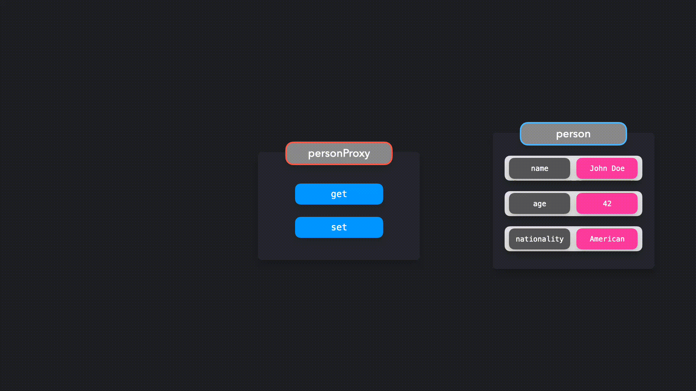

## Proxy Pattern

---

Bu yazı [patterns.dev](https://www.patterns.dev/posts/proxy-pattern/)'den çevirilmiş.

---

*Hedef nesnelerle etkileşimleri durdurun ve kontrol edin.*


Bir Proxy nesnesiyle, belirli nesnelerle etkileşimler üzerinde daha fazla kontrol sahibi oluruz. Bir proxy nesnesi, örneğin bir değer alırken veya bir değer ayarlarken, nesneyle etkileşime girdiğimizde davranışı belirleyebilir.

Genel olarak konuşursak, bir vekil başka biri için vekil anlamına gelir. Bu kişiyle doğrudan konuşmak yerine, ulaşmaya çalıştığınız kişiyi temsil edecek vekil kişiyle konuşacaksınız. Aynısı JavaScript’te de olur: doğrudan hedef nesneyle etkileşim kurmak yerine, Proxy nesnesiyle etkileşim kurarız.

John Doe’yu temsil eden bir `person` nesnesi oluşturalım.

```js
const person = {
  name: "John Doe",
  age: 42,
  nationality: "American"
};
```

Bu nesneyle doğrudan etkileşim kurmak yerine, bir proxy nesnesi ile etkileşim kurmak istiyoruz. JavaScript’te, `Proxy` sınıfını kullanarak `new Proxy()` ilekolayca yeni bir `proxy` oluşturabiliriz.

```js
const person = {
  name: "John Doe",
  age: 42,
  nationality: "American"
};
const personProxy = new Proxy(person, {});
```

`Proxy`‘nin ikinci argümanı, *işleyiciyi (handler)* temsil eden bir nesnedir. İşleyici nesnesinde, etkileşim türüne göre belirli davranışı tanımlayabiliriz. Proxy işleyicisine ekleyebileceğiniz **birçok metod** olmasına rağmen, en yaygın iki tanesi `get` ve `set` metodudur:

* `get`: Bir özelliğe erişmeye çalışırken çağrılır
* `set`: Bir özelliği değiştirmeye çalışırken çağrılır

Efektik olarak sonunda olacak ise şudur:



`person` nesnesiyle doğrudan etkileşim kurmak yerine, `personProxy` ile etkileşime geçeceğiz. `personProxy` 'ye handlerlar (işleyiciler) ekleyelim. Bir özelliği değiştirmeye çalışırken, böylece `Proxy`’de `set` metodunu çağırırken, proxy’nin özelliğin önceki değerini ve yeni değerini günlüğe (loglara) kaydetmesini istiyoruz. Bir özelliğe erişmeye çalışırken, böylece `Proxy`‘de `get` metodunu çağırırken, proxy’nin özelliğin anahtarını ve değerini içeren daha okunabilir bir cümleyi günlüğe kaydetmesini istiyoruz.

```js
const personProxy = new Proxy(person, {
  get: (obj, prop) => {
    console.log(`The value of ${prop} is ${obj[prop]}`);
  },
  set: (obj, prop, value) => {
    console.log(`Changed ${prop} from ${obj[prop]} to ${value}`);
    obj[prop] = value;
  }
});
```

Mükemmel! Bir özelliği değiştirmeye veya çağırmaya çalıştığımızda ne olduğunu görelim.

---

Bu kısımdaki kodlara [codesandbox](https://codesandbox.io/embed/cocky-bird-rkgyo) üzerinden erişebilirsiniz.

---

`name` özelliğine erişirken, Proxy daha kulağa hoş gelen bir cümle döndürdü: `The value of name is John Doe.`

`age` özelliğini değiştirirken, Proxy bu özelliğin önceki ve yeni değerini döndürdü: `Changed age from 42 to 43.`

Validasyon eklemek için bir proxy yararlı olabilir. Bir kullanıcı, `person` nesnesinin yaşını bir string veri değeriyle değiştirememeli veya onlara boş bir ad vermemelidir. Veya kullanıcı, nesne üzerinde var olmayan bir özelliğe erişmeye çalışıyorsa bunu kullanıcıya bildirmeliyiz.

```js
const personProxy = new Proxy(person, {
  get: (obj, prop) => {
    if (!obj[prop]) {
      console.log(
        `Hmm.. this property doesn't seem to exist on the target object`
      );
    } else {
      console.log(`The value of ${prop} is ${obj[prop]}`);
    }
  },
  set: (obj, prop, value) => {
    if (prop === "age" && typeof value !== "number") {
      console.log(`Sorry, you can only pass numeric values for age.`);
    } else if (prop === "name" && value.length < 2) {
      console.log(`You need to provide a valid name.`);
    } else {
      console.log(`Changed ${prop} from ${obj[prop]} to ${value}.`);
      obj[prop] = value;
    }
  }
});
```

Hatalı değerleri aktarmaya çalıştığımızda ne olacağını görelim!

---

Bu kısımdaki kodlara [codesandbox](https://codesandbox.io/embed/focused-rubin-dgk2v) üzerinden erişebilirsiniz.

---

Proxy, `person` nesnesini hatalı değerlerle değiştirmediğimizden emin oldu, bu da verilerimizi saf tutmamıza yardımcı oldu!

## Reflect (Yansıtma)
JavaScript, proxy’lerle çalışırken hedef nesneyi değiştirmemizi kolaylaştıran `Reflect` adlı yerleşik bir nesne sağlar.

Önceden, parantez notasyonu ile değerleri doğrudan alarak veya ayarlayarak proxy içindeki hedef nesne üzerindeki özellikleri değiştirmeye ve erişmeye çalıştık. Bunun yerine `Reflect` nesnesini kullanabiliriz. `Reflect` nesnesindeki yöntemler, `handler` nesnesindeki yöntemlerle aynı ada sahiptir.

Özelliklere `obj[prop]` aracılığıyla erişmek veya özellikleri `obj[prop] = value` aracılığıyla ayarlamak yerine, `Reflect.get()` ve `Reflect.set()` aracılığıyla hedef nesnedeki özelliklere erişebilir veya bunları değiştirebiliriz. Yöntemler, handler nesnesindeki yöntemlerle aynı argümanları alır.

```js
const personProxy = new Proxy(person, {
  get: (obj, prop) => {
    console.log(`The value of ${prop} is ${Reflect.get(obj, prop)}`);
  },
  set: (obj, prop, value) => {
    console.log(`Changed ${prop} from ${obj[prop]} to ${value}`);
    Reflect.set(obj, prop, value);
  }
});
```

Mükemmel! `Reflect` nesnesi ile hedef nesne üzerindeki özelliklere kolayca erişebilir ve bunları değiştirebiliriz.

---

Bu kısımdaki kodlara [codesandbox](https://codesandbox.io/embed/gallant-violet-o1hjx) üzerinden erişebilirsiniz.

---

Proxy’ler, bir nesnenin davranışı üzerinde kontrol eklemenin güçlü bir yoludur. Bir proxy’nin çeşitli kullanım durumları olabilir: doğrulama, biçimlendirme, bildirimler veya hata ayıklama konusunda yardımcı olabilir.

`Proxy` nesnesini aşırı kullanmak veya her bir `handler` yöntemi çağrısında ağır işlemler gerçekleştirmek, uygulamanızın performansını kolayca olumsuz etkileyebilir. Performans açısından kritik kodlar için proxy kullanmamak en iyisidir.

### Kaynaklar

* [Proxy](https://developer.mozilla.org/en-US/docs/Web/JavaScript/Reference/Global_Objects/Proxy) — MDN
* [JavaScript Proxy](https://davidwalsh.name/javascript-proxy) — David Walsh
* [Awesome ES2015 Proxy](https://github.com/mikaelbr/awesome-es2015-proxy) — GitHub @mikaelbr
* [Thoughts on ES6 Proxies Performance](http://thecodebarbarian.com/thoughts-on-es6-proxies-performance) — Valeri Karpov