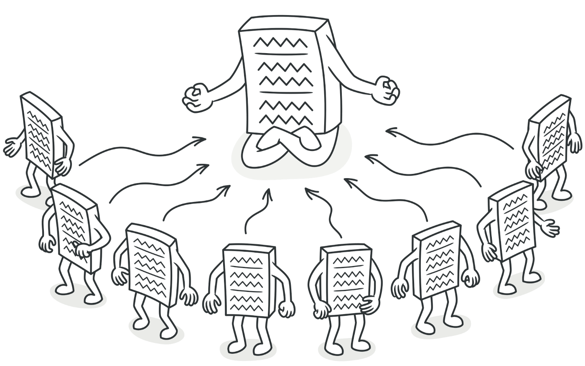

# Skeleton Pattern
*Uygulamamız boyunca tek bir global instance’ı paylaşın.*



Singleton’lar, tek bir instance’ı olan ve global olarak erişilebilen sınıflardır. *Tek instance*, uygulamamız genelinde paylaşılabilir, bu da Singletonları bir uygulamada global state’i yönetmek için harika kılar.

İlk olarak, bir ES2015 sınıfını kullanarak bir singleton’un nasıl görünebileceğine göz atalım. Bu örnek için, aşağıdaki metodları içeren bir **Counter** sınıfı oluşturacağız:

* `instance`’ın değerini döndüren bir `getInstance` metodu

* mevcut `counter`  değerini döndüren bir `getCount` metodu

* `counter`  ‘ın değerini bir arttıran `increment` metodu

* `counter` ‘ın değerini bir azaltan `decrement` metodu

```
let counter = 0;
class Counter {
  getInstance() {
    return this;
  }
  getCount() {
    return counter;
  }
  increment() {
    return ++counter;
  }
  decrement() {
    return --counter;
  }
}
```

Ancak bu sınıf, Singleton kriterlerini karşılamıyor! Bir Singleton instance’ı **yalnızca bir kez** oluşturulabilir.

```
let counter = 0;
class Counter {
  getInstance() {
    return this;
  }
  getCount() {
    return counter;
  }
  increment() {
    return ++counter;
  }
  decrement() {
    return --counter;
  }
}
const counter1 = new Counter();
const counter2 = new Counter();
console.log(counter1.getInstance() === counter2.getInstance()); 
// false
```

`new` metodunu iki kez çağırarak `counter1` ve `counter2` değişkenlerini iki farklı instance’a eşitledik. `counter1` ve `counter2` 'nin `getInstance` metodu tarafından döndürülen değerler, etkin bir şekilde farklı instancelara referanslar döndürdü: bunlar kesinlikle eşit değiller!


Şimdi `Counter` tek bir kez oluşturulduğundan emin olalım. Yalnızca bir instance’ın oluşturulabileceğinden emin olmanın bir yolu, `instance` adlı bir değişken oluşturmaktır. `Counter` ‘ın `constructor` metodunda bir instance oluşturulduğunda, `instance` ‘ı bir `instance`’a referans olarak atayabiliriz. `instance` değişkenin zaten bir değeri olup olmadığını kontrol ederek yeni instance oluşumlarını önleyebiliriz. Eğer bir instance zaten varsa bu olmamalı: kullanıcıyı durumdan haberdar etmek için hata fırlatılmalıdır.

```
let instance;
let counter = 0;
class Counter {
  constructor() {
    if (instance) {
      throw new Error("You can only create one instance!");
    }
    instance = this;
  }
  getInstance() {
    return this;
  }
  getCount() {
    return counter;
  }
  increment() {
    return ++counter;
  }
  decrement() {
    return --counter;
  }
}
const counter1 = new Counter();
const counter2 = new Counter();
// Error: You can only create one instance!
```

Mükemmel! Artık birden fazla instance oluşturamayız.

`counter` instance’ını `counter.js` dosyasından dışa aktaralım. Ancak bunu yapmadan önce örneği de dondurmalıyız ([Object.freeze](https://developer.mozilla.org/en-US/docs/Web/JavaScript/Reference/Global_Objects/Object/freeze?retiredLocale=tr)). The `Object.freeze` metodu, kodun tüketilmesinin Singleton’ı değiştirememesini sağlar. Dondurulmuş instance’taki özellikler eklenemez veya değiştirilemez, bu da Singleton’daki değerlerin yanlışlıkla üzerine yazma riskini azaltır.

```
let instance;
let counter = 0;
class Counter {
  constructor() {
    if (instance) {
      throw new Error("You can only create one instance!");
    }
    instance = this;
  }
  getInstance() {
    return this;
  }
  getCount() {
    return counter;
  }
  increment() {
    return ++counter;
  }
  decrement() {
    return --counter;
  }
}
const singletonCounter = Object.freeze(new Counter());
export default singletonCounter;
```

Şimdi `Counter` instance’ını uygulayan bir uygulamaya bakalım. Aşağıdaki dosyalara sahibiz:

* `counter.js`: `Counter` sınıfını içerir ve bir `Counter` instance’ını varsayılan dışa aktarma olarak dışa aktarır (`export default`).

* `index.js`: `redButton.js` ve `blueButton.js` modüllerini yükler.

* `Counter`‘ı içe aktarır ve **kırmızı** buttona event dinleyicisi olarak `Counter`'ın arttırma metodunu ekler ve `getCount` metodunu çağırarak sayacın geçerli değerini sıralı kayıtlara (loglara) kaydeder.

- `Counter`'ı içe aktarır ve mavi buttona event dinleyicisi olarak arttırma metodunu ekler ve `getCount` metodunu çağırarak sayacın geçerli değerini sıralı kayıtlara (loglara) kaydeder.

Hem `blueButton.js` hem de `redButton.js`, aynı instance’ı `counter.js` ‘den içe aktarır. Bu instance, her iki dosyada da `Counter` olarak içe aktarılır.


`redButton.js` veya `blueButton.js` dosyasında artırma metodunu çağırdığımızda, `Counter` instance’ındaki `counter` özelliğinin değeri her iki dosyada da güncellenir. **Kırmızı** veya **mavi** buttona tıklamamızın bir önemi yok: aynı değer **tüm instancelar** arasında paylaşılıyor. Bu nedenle, yöntemi farklı dosyalarda çağırıyor olmamıza rağmen, `counter` birer birer artmaya devam ediyor.

***

## Avantajları ve Dezavantajları

Instance oluşturmayı yalnızca bir instance ile sınırlamak, potansiyel olarak çok fazla bellek alanından tasarruf sağlayabilir. Her seferinde yeni bir instance için bellek kurmak yerine, uygulama boyunca başvurulan yalnızca bir instance için bellek kurmamız gerekir. Bununla birlikte, Singletonlar aslında bir **anti-kalıp** (**anti-pattern**) olarak kabul edilir ve JavaScript’te kaçınılabilir (veya kaçınılmalıdır).

Java veya C++ gibi birçok programlama dilinde, JavaScript’te yapabildiğimiz şekilde nesneleri doğrudan oluşturmak mümkün değildir. Nesne yönelimli programlama dillerinde nesne oluşturan bir sınıf oluşturmamız gerekir. Oluşturulan nesne, tıpkı JavaScript örneğindeki `instance` değeri gibi, sınıfın instance’ının değerine sahiptir.

Ancak, yukarıdaki örneklerde gösterilen sınıf uygulaması aslında aşırıya kaçıyor. JavaScript’te doğrudan nesneler oluşturabildiğimiz için, aynı sonucu elde etmek için normal bir nesne kullanabiliriz. Singletonları kullanmanın bazı dezavantajlarını ele alalım!

## Normal bir nesne kullanma
Daha önce gördüğümüzle aynı örneği kullanalım. Ancak bu sefer `counter` basitçe şunları içeren bir nesnedir:

* bir `count` özelliği
* `count` değerini bir arttıran `increment` metodu
* `count` değerini bir azaltan `decrement` metodu

***
Bu kısımdaki kodlara [codesandbox](https://codesandbox.io/embed/competent-moon-rvzrr) üzerinden erişebilirsiniz.
***

Nesneler referansa göre iletildiğinden, hem `redButton.js` hem de `blueButton.js` aynı `counter` nesnesine bir referansı içe aktarır. Bu dosyalardan herhangi birinde `count` değerini değiştirmek, her iki dosyada da görünen sayaçtaki değeri değiştirecektir.

## Test süreci

Singleton’a dayanan kodu test etmek zor olabilir. Her seferinde yeni instancelar oluşturamadığımız için tüm testler, önceki testin genel instance’ında yapılan değişikliğe dayanır. Bu durumda testlerin sırası önemlidir ve küçük bir değişiklik tüm test paketinin başarısız olmasına neden olabilir. Testten sonra, testler tarafından yapılan değişiklikleri sıfırlamak için tüm instance’ı sıfırlamamız gerekiyor.

***
Bu kısımdaki kodlara [codesandbox](https://codesandbox.io/embed/sweet-cache-n55vi) üzerinden erişebilirsiniz.
***

## Bağımlılık gizleme
Başka bir modülü içe aktarırken, bu durumda `superCounter.js`, modülün bir Singleton içe aktardığı açık olmayabilir. Bu durumda `index.js` gibi diğer dosyalarda, bu modülü içe aktarıyor ve metodlarını çağırıyor olabiliriz. Bu şekilde, Singleton’daki değerleri yanlışlıkla değiştiririz. Singleton’ın birden çok instance’ı uygulama boyunca paylaşılabildiğinden, bu beklenmedik davranışlara yol açabilir ve bunların tümü de değiştirilir.

***
Bu kısımdaki kodlara [codesandbox](https://codesandbox.io/embed/sweet-cache-n55vi) üzerinden erişebilirsiniz.
***

## Global davranış

Bir Singleton instance’ına, uygulamanın tamamında başvuruda bulunulabilmelidir. Global değişkenler temelde aynı davranışı gösterirler: global değişkenler global kapsamda mevcut olduğundan, bu değişkenlere uygulama boyunca erişebiliriz.

Global değişkenlere sahip olmak genellikle kötü bir tasarım kararı olarak kabul edilir. Global kapsam kirliliği, yanlışlıkla global bir değişkenin değerinin üzerine yazılmasıyla sonuçlanabilir ve bu da birçok beklenmedik davranışa yol açabilir.

ES2015'te global değişkenler oluşturmak oldukça nadirdir. Yeni `let` ve `const` anahtar sözcüğü, bu iki anahtar sözcükle bildirilen değişkenleri blok kapsamlı tutarak geliştiricilerin yanlışlıkla global kapsamı kirletmesini önler. JavaScript’teki yeni `module` sistemi, değerleri bir modülden `export` ederek ve bu değerleri diğer dosyalarda `import` ederek global kapsamı kirletmeden global olarak erişilebilir değerler oluşturmayı kolaylaştırır.

Bununla birlikte, bir Singleton için yaygın kullanım durumu, uygulamanız boyunca bir tür **global state**’e sahip olmaktır. Kod tabanınızın birden çok parçasının aynı **değiştirilebilir nesneye** (mutable object) bağlı olması beklenmeyen davranışlara yol açabilir.

Genellikle, kod tabanının belirli kısımları global state içindeki değerleri değiştirirken, diğerleri bu verileri tüketir. Buradaki yürütme sırası önemlidir: tüketilecek veri olmadığında (henüz) yanlışlıkla verileri ilk önce tüketmek istemiyoruz! Global bir state kullanırken veri akışını anlamak, uygulamanız büyüdükçe ve düzinelerce bileşen birbirine bağlandıkça çok zorlaşabilir.

## React’te state yönetimi
React’te, Singletons kullanmak yerine **Redux** veya **React Context** gibi state yönetimi araçları aracılığıyla genellikle global bir state’e başvururuz. Global state davranışları Singleton’ınkine benzer görünse de, bu araçlar Singleton’ın *değişken* durumundan ziyade **salt okunur** bir durum sağlar. Redux kullanırken, bir bileşen bir *dispatcher* aracılığıyla bir *action* gönderdikten sonra, yalnızca salt işlev azaltıcılar durumu güncelleyebilir.

Global bir state’e sahip olmanın dezavantajları bu araçları kullanarak sihirli bir şekilde ortadan kaybolmasa da, bileşenler durumu doğrudan güncelleyemediğinden, en azından global state’in istediğimiz şekilde mutasyona uğradığından emin olabiliriz.

---

Singleton tasarım kalıbının sonlarına gelirken en sık kullanım amaçları ise şunlardır;

* Logging
* Driver objects,
* Caching,
* Thread pool

Ayrıca *Abstract Factory*, *Builder*, *Prototype*, *Facade* gibi diğer tasarım kalıpları ile de birlikte kullanılabilirler.

### Kaynaklar
* [Patterns.dev](https://www.patterns.dev/posts/singleton-pattern/)
* [Do React Hooks replace Redux — Eric Elliott](https://medium.com/javascript-scene/do-react-hooks-replace-redux-210bab340672)
* [JavaScript Design Patterns: The Singleton — Samier Saeed](https://www.sitepoint.com/javascript-design-patterns-singleton/)
* [Singleton — Refactoring Guru](https://refactoring.guru/design-patterns/singleton)