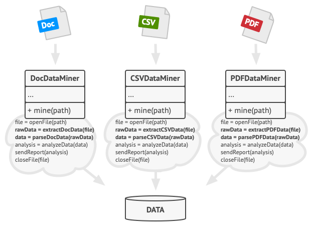
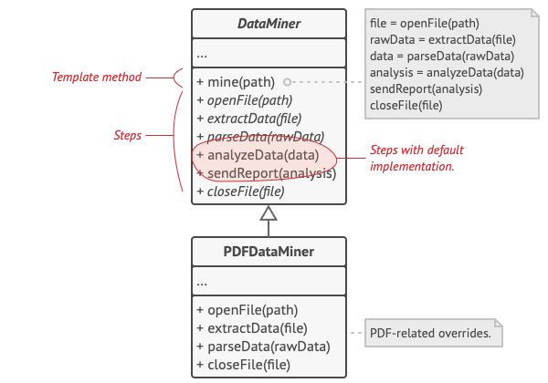
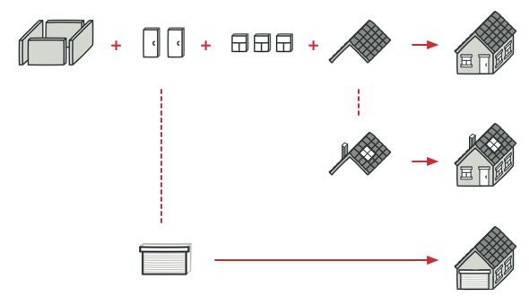
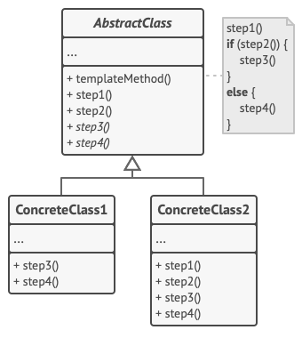
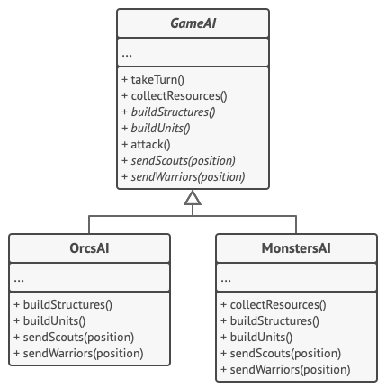

# Template Method

---

Bu yazı [refactoring.guru](https://refactoring.guru/design-patterns/template-method)'dan çevirilmiştir.

---

## Amaç

`Template Method`, üst sınıfta bir algoritmanın iskeletini tanımlayan ancak alt sınıfların algoritmanın yapısını değiştirmeden belirli adımlarını geçersiz kılmasına izin veren davranışsal bir tasarım modelidir.


## Problem

Kurumsal belgeleri analiz eden bir veri madenciliği uygulaması oluşturduğunuzu düşünün. Kullanıcılar uygulamaya çeşitli formatlarda (PDF, DOC, CSV) dokümanlar gönderiyor ve uygulama bu dokümanlardan tek tip bir formatta anlamlı veriler çıkarmaya çalışıyor.

Uygulamanın ilk versiyonu sadece DOC dosyaları ile çalışabiliyordu. Sonraki sürümde CSV dosyalarını da destekleyebildi. Bir ay sonra, PDF dosyalarından veri çıkarmayı "öğrettiniz".



_<p align="center">Veri madenciliği sınıfları çok sayıda yinelenen kod içeriyordu.</p>_

Bir noktada, her üç sınıfın da çok sayıda benzer koda sahip olduğunu fark ettiniz. Çeşitli veri formatlarıyla uğraşma kodu tüm sınıflarda tamamen farklı olsa da, veri işleme ve analiz kodu neredeyse aynıydı. Algoritma yapısını olduğu gibi bırakarak kod tekrarından kurtulmak harika olmaz mıydı?

Bu sınıfları kullanan istemci koduyla ilgili başka bir sorun daha vardı. İşleme nesnesinin sınıfına bağlı olarak uygun bir eylem yolu seçen çok sayıda koşullu kod vardı. Her üç işleme sınıfının da ortak bir arayüzü ya da bir temel sınıfı olsaydı, istemci kodundaki koşullu ifadeleri ortadan kaldırabilir ve bir işleme nesnesi üzerindeki yöntemleri çağırırken çok biçimliliği kullanabilirdiniz.

## Çözüm

Şablon Yöntem kalıbı, bir algoritmayı adım adım ayırmanızı, bu adımları yöntemlere dönüştürmenizi ve bu yöntemlere yapılan bir dizi çağrıyı tek bir şablon yöntemin içine yerleştirmenizi önerir. Adımlar `soyut` olabilir ya da bazı varsayılan uygulamalara sahip olabilir. Algoritmayı kullanmak için, istemcinin kendi alt sınıfını sağlaması, tüm soyut adımları uygulaması ve gerekirse isteğe bağlı olanlardan bazılarını geçersiz kılması gerekir (ancak şablon yönteminin kendisini değil).

Bunun veri madenciliği uygulamamızda nasıl çalışacağını görelim. Her üç ayrıştırma algoritması için bir temel sınıf oluşturabiliriz. Bu sınıf, çeşitli belge işleme adımlarına yapılan bir dizi çağrıdan oluşan bir şablon yöntemi tanımlar.



_<p align="center">Şablon yöntemi algoritmayı adımlara böler ve alt sınıfların bu adımları geçersiz kılmasına izin verir, ancak asıl yöntemi geçersiz kılmaz.</p>_

İlk olarak, tüm adımları `soyut` olarak bildirebilir ve alt sınıfları bu yöntemler için kendi uygulamalarını sağlamaya zorlayabiliriz. Bizim durumumuzda, alt sınıflar zaten gerekli tüm uygulamalara sahiptir, bu nedenle yapmamız gereken tek şey yöntemlerin imzalarını üst sınıfın yöntemleriyle eşleşecek şekilde ayarlamak olabilir.

Şimdi, tekrarlanan koddan kurtulmak için ne yapabileceğimize bakalım. Görünüşe göre dosyaları açma/kapama ve verileri ayıklama/ayrıştırma kodları çeşitli veri formatları için farklıdır, bu nedenle bu yöntemlere dokunmanın bir anlamı yoktur. Ancak, ham verilerin analiz edilmesi ve raporların oluşturulması gibi diğer adımların uygulanması çok benzerdir, bu nedenle alt sınıfların bu kodu paylaşabileceği temel sınıfa çekilebilir.

Gördüğünüz gibi iki tip adımımız var:

- _Soyut adımlar_ her alt sınıf tarafından uygulanmalıdır.

- _İsteğe bağlı adımlar_ zaten bazı varsayılan uygulamalara sahiptir, ancak yine de gerekirse geçersiz kılınabilir.

Kanca adı verilen başka bir adım türü daha vardır. Kanca, boş bir gövdeye sahip isteğe bağlı bir adımdır. Bir kanca geçersiz kılınmasa bile bir şablon yöntemi çalışacaktır. Genellikle kancalar, algoritmaların önemli adımlarından önce ve sonra yerleştirilir ve alt sınıflara bir algoritma için ek uzantı noktaları sağlar.

## Gerçek Dünya Analojisi



_<p align="center">Tipik bir mimari plan, müşterinin ihtiyaçlarına daha iyi uyması için biraz değiştirilebilir.</p>_

Şablon yöntemi yaklaşımı konut yapımında kullanılabilir. Standart bir ev inşa etmeye yönelik mimari plan, potansiyel bir mal sahibinin ortaya çıkan evin bazı ayrıntılarını ayarlamasına izin verecek birkaç uzatma noktası içerebilir.

Temel atma, çerçeveleme, duvar örme, su ve elektrik tesisatı kurma ve kablolama gibi her bir inşaat adımı, ortaya çıkan evi diğerlerinden biraz farklı kılmak için biraz değiştirilebilir.

## Yapı



_1._ **Soyut Sınıf**, bir algoritmanın adımları olarak hareket eden yöntemlerin yanı sıra bu yöntemleri belirli bir sırada çağıran gerçek şablon yöntemini de bildirir. Adımlar `soyut` olarak bildirilebilir veya bazı varsayılan uygulamalara sahip olabilir..

_2._ **Somut Sınıflar** tüm adımları geçersiz kılabilir, ancak şablon yönteminin kendisini geçersiz kılamaz.

## Sözde Kod

Bu örnekte, **Şablon Yöntemi** kalıbı, basit bir strateji oyununda çeşitli yapay zeka dalları için bir "iskelet" sağlar.



_<p align="center">Basit bir strateji oyununun yapay zeka sınıfları.</p>_

Oyundaki tüm ırklar neredeyse aynı tür birimlere ve binalara sahiptir. Bu nedenle, aynı yapay zeka yapısını çeşitli ırklar için yeniden kullanabilir ve bazı ayrıntıları geçersiz kılabilirsiniz. Bu yaklaşımla, orkların yapay zekasını daha agresif hale getirebilir, insanları daha savunma odaklı yapabilir ve canavarları hiçbir şey inşa edemez hale getirebilirsiniz. Oyuna yeni bir ırk eklemek için yeni bir YZ alt sınıfı oluşturmak ve temel YZ sınıfında bildirilen varsayılan yöntemleri geçersiz kılmak gerekir.

```js
    // Soyut sınıf, genellikle soyut ilkel işlemlere yapılan çağrılardan oluşan
    // bazı algoritmaların iskeletini içeren bir şablon yöntem tanımlar.
    // Somut alt sınıflar bu işlemleri uygular,
    // ancak şablon yönteminin kendisini sağlam bırakır.
class GameAI is
    // Şablon yöntemi bir algoritmanın iskeletini tanımlar.
    method turn() is
        collectResources()
        buildStructures()
        buildUnits()
        attack()

    // Bazı adımlar doğrudan bir temel sınıfta uygulanabilir.
    method collectResources() is
        foreach (s in this.builtStructures) do
            s.collect()

    // Bunlardan bazıları soyut olarak tanımlanabilir.
    abstract method buildStructures()
    abstract method buildUnits()

    // Bir sınıfın birden fazla şablon yöntemi olabilir.
    method attack() is
        enemy = closestEnemy()
        if (enemy == null)
            sendScouts(map.center)
        else
            sendWarriors(enemy.position)

    abstract method sendScouts(position)
    abstract method sendWarriors(position)

    // Somut sınıflar, temel sınıfın tüm soyut işlemlerini uygulamak zorundadır,
    // ancak şablon yönteminin kendisini geçersiz kılmamalıdır.
class OrcsAI extends GameAI is
    method buildStructures() is
        if (there are some resources) then
            // Önce çiftlikler, sonra kışlalar, sonra da kale inşa edin.

    method buildUnits() is
        if (there are plenty of resources) then
            if (there are no scouts)
                // Peon oluştur, izci grubuna ekle.
            else
                // Grunt oluştur, savaşçılar grubuna ekle.

    // ...

    method sendScouts(position) is
        if (scouts.length > 0) then
            // Gözcüler gönderin.

    method sendWarriors(position) is
        if (warriors.length > 5) then
            // Savaşçılar gönderin

    // Alt sınıflar ayrıca bazı işlemleri varsayılan bir uygulama ile geçersiz kılabilir.
class MonstersAI extends GameAI is
    method collectResources() is
        // Canavarlar kaynak toplayamaz.

    method buildStructures() is
        // Canavarlar yapı inşa edemez.

    method buildUnits() is
        // Canavarlar birim oluşturamaz.
```

## Uygulanabilirlik

**İstemcilerin bir algoritmanın tümünü veya yapısını değil, yalnızca belirli adımlarını genişletmesine izin vermek istediğinizde Şablon Yöntemi modelini kullanın.**

Şablon Yöntemi, monolitik bir algoritmayı, bir üst sınıfta tanımlanan yapı bozulmadan alt sınıflar tarafından kolayca genişletilebilen bir dizi bireysel adıma dönüştürmenizi sağlar.

**Bu kalıbı, bazı küçük farklılıklarla birlikte neredeyse aynı algoritmaları içeren birkaç sınıfınız olduğunda kullanın. Sonuç olarak, algoritma değiştiğinde tüm sınıfları değiştirmeniz gerekebilir.**

Böyle bir algoritmayı bir şablon yönteme dönüştürdüğünüzde, benzer uygulamalara sahip adımları bir üst sınıfa da çekerek kod tekrarını ortadan kaldırabilirsiniz. Alt sınıflar arasında değişiklik gösteren kod, alt sınıflarda kalabilir.

## Nasıl Uygulanır?

_1._ Hedef algoritmayı adımlara bölüp bölemeyeceğinizi görmek için analiz edin. Hangi adımların tüm alt sınıflar için ortak olduğunu ve hangilerinin her zaman benzersiz olacağını düşünün.

_2._ Soyut temel sınıfı oluşturun ve şablon yöntemini ve algoritmanın adımlarını temsil eden bir dizi soyut yöntemi tanımlayın. İlgili adımları uygulayarak şablon yönteminde algoritmanın yapısını ana hatlarıyla belirleyin. Alt sınıfların bunu geçersiz kılmasını önlemek için şablon yöntemini `son haline` getirmeyi göz önünde bulundurun.

_3._ Tüm adımların soyut olması sorun değildir. Ancak, bazı adımlar varsayılan bir uygulamaya sahip olmak açısından fayda sağlayabilir. Alt sınıflar bu yöntemleri uygulamak zorunda değildir.

_4._ Algoritmanın önemli adımları arasına kanca eklemeyi düşünün.

_5._ Algoritmanın her bir varyasyonu için yeni bir somut alt sınıf oluşturun. Tüm soyut adımları uygulamalı, ancak isteğe bağlı olanlardan bazılarını da geçersiz kılabilmelidir.

## Artılar ve Eksiler

✓ İstemcilerin büyük bir algoritmanın yalnızca belirli bölümlerini geçersiz kılmasına izin verebilir, böylece algoritmanın diğer bölümlerinde meydana gelen değişikliklerden daha az etkilenmelerini sağlayabilirsiniz.

✓ Tekrar eden kodu bir üst sınıfa çekebilirsiniz.

✗ Bazı istemciler, bir algoritmanın sağlanan iskeleti ile sınırlı olabilir.

✗ Bir alt sınıf aracılığıyla varsayılan bir adım uygulamasını bastırarak _Liskov İkame İlkesini_ ihlal edebilirsiniz.

✗ Şablon yöntemleri ne kadar çok adımdan oluşursa bakımı da o kadar zor olur.

## Diğer Paternlerle İlişkiler

- `Fabrika Yöntemi`, `Şablon Yöntemi'nin` bir uzmanlık alanıdır. Aynı zamanda, bir _Fabrika Yöntemi_ büyük bir _Şablon Yönteminde_ bir adım olarak hizmet edebilir.

- `Şablon Yöntemi` kalıtıma dayanır: bir algoritmanın parçalarını, bu parçaları alt sınıflarda genişleterek değiştirmenize olanak tanır. `Strateji` kompozisyona dayanır: nesnenin davranışının bazı kısımlarını, bu davranışa karşılık gelen farklı stratejiler sağlayarak değiştirebilirsiniz. Şablon Yöntemi sınıf düzeyinde çalışır, bu nedenle statiktir. Strateji, nesne düzeyinde çalışır ve çalışma zamanında davranışları değiştirmenize olanak tanır.
